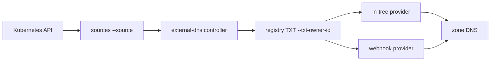

# kubernetes-sigs/external-dns

> Contrôleur qui synchronise Services et Ingresses Kubernetes avec un fournisseur DNS externe.

## Le problème
Créer à la main un enregistrement DNS pour chaque Service exposé, puis le corriger quand l'IP du load balancer change, ne tient pas à l'échelle.

## Ce que ça fait vraiment
Lit les ressources Kubernetes (Ingress, Service, Node, Gateway API, CRD DNSEndpoint…) pour déduire les enregistrements souhaités.
Configure le fournisseur DNS — Route 53, Cloud DNS, AzureDNS, Cloudflare, PowerDNS et une quinzaine d'autres in-tree.
Marque ce qu'il gère avec des TXT (`--txt-owner-id`), ce qui lui permet de cohabiter dans une zone non vide.
Les nouveaux fournisseurs passent par un système de webhooks : plus aucun provider in-tree n'est accepté.

## Comment c'est branché


## Essayer
```console
kubectl run nginx --image=nginx --port=80
kubectl expose pod nginx --port=80 --target-port=80 --type=LoadBalancer
kubectl annotate service nginx "external-dns.kubernetes.io/hostname=nginx.example.org."
external-dns --txt-owner-id my-cluster-id --provider google --google-project example-project --source service --once --dry-run
```

## Coût et pièges
Gratuit, mais l'API du fournisseur DNS et la zone sont à ta charge. Changer `--txt-prefix` fait perdre la propriété des enregistrements déjà créés. Avec `--policy=upsert-only` rien n'est jamais supprimé. Les webhooks tiers ne sont pas relus par les mainteneurs.

## Ce que ce n'est pas
Pas un serveur DNS : il configure des fournisseurs, il ne résout rien. Pas rétrocompatible sans lire le tableau de compatibilité : v0.10.0, v0.18.0 et v0.19.0 introduisent des ruptures. Pas un gestionnaire de certificats.

## Alternatives
Kops' DNS Controller, Zalando's Mate, route53-kubernetes de Molecule Software — les trois projets que external-dns unifie, cités dans la section Heritage.

## Pour toi
Standard incontournable dès que tu exposes des services depuis Kubernetes, y compris pour des endpoints d'inférence.
