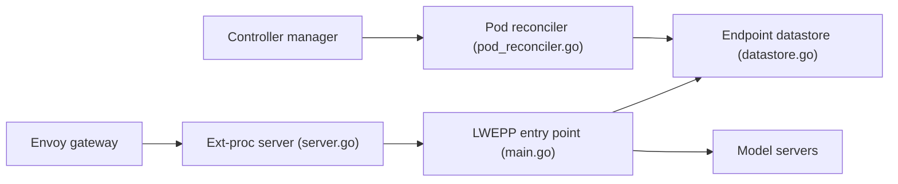

# kubernetes-sigs/gateway-api-inference-extension

> Extension Gateway API qui transforme une passerelle Envoy en passerelle d'inférence pour modèles auto-hébergés.

## Le problème
Un équilibreur classique ignore le cache KV, les adaptateurs LoRA et le coût des requêtes LLM, ce qui dégrade latence et débit.

## Ce que ça fait vraiment
Via ext-proc d'Envoy, un sélecteur de point d'accès (EPP) choisit la meilleure réplique de serveur de modèle. Ce dépôt ne garde plus que l'API InferencePool, un EPP léger (LWEPP) de référence et les tests de conformité. L'EPP principal et le routeur de corps ont déménagé vers llm-d et seront archivés ici.

## Comment c'est branché


## Essayer
```bash
# Le README renvoie au Getting Started Guide ; aucune commande n'y figure
```

## Coût et pièges
Gratuit ; suppose un cluster avec une passerelle compatible ext-proc et des GPU. Le code principal bouge : lis bien la note de déménagement avant de choisir où t'appuyer.

## Ce que ce n'est pas
Ce n'est plus l'implémentation complète de l'EPP : seul le léger reste ici. Pas un serveur de modèles.

## Alternatives
llm-d/llm-d-router (EPP et API associées) et llm-d/llm-d-inference-payload-processor (BBR), cités dans le README.

## Pour toi
À surveiller : référence pour le routage d'inférence sur Kubernetes, mais pour la production regarde d'abord llm-d, où le code se déplace.

