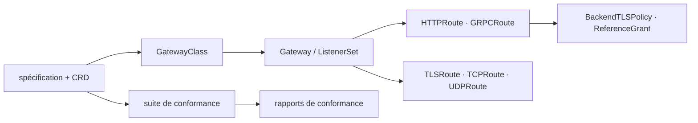

# kubernetes-sigs/gateway-api

> Spécification et CRD de la Gateway API Kubernetes, pour implémenteurs de contrôleurs et opérateurs.

## Le problème
L'Ingress Kubernetes est trop pauvre et chaque contrôleur ajoute ses annotations propriétaires.
Sans conformance vérifiable, impossible de comparer deux implémentations.

## Ce que ça fait vraiment
Contient la spécification et les Custom Resource Definitions. Version supportée `v1`, publiée
par la release v1.6.1. Ressources en support GA : `GatewayClass`, `Gateway`, `ListenerSet`,
`HTTPRoute`, `GRPCRoute`, `TLSRoute`, `TCPRoute`, `UDPRoute`, `BackendTLSPolicy`, `ReferenceGrant`.
Fournit une suite de tests de conformance, des rapports soumis par les implémentations,
et un site de documentation avec concepts, modèle de sécurité et guides de démarrage.

## Comment c'est branché

## Essayer
Aucune commande documentée dans le README : il renvoie au guide « getting started » du site
pour installer un premier contrôleur Gateway.

## Coût et pièges
Gratuit. Tous les objets ne sont pas GA : pour les autres API, il faut consulter leur niveau de support
dans la spec. La licence n'est pas déclarée dans le README.

## Ce que ce n'est pas
Ce n'est pas une implémentation : il n'y a pas de contrôleur ici, seulement l'API et les tests.
Ce n'est pas un remplaçant direct d'Ingress sans un contrôleur compatible en face.
Ce n'est pas un projet d'un éditeur : c'est une partie de SIG Network.

## Alternatives
Aucune nommée ; les implémentations sont renvoyées aux rapports de conformance.

## Pour toi
Référence à connaître de nom si tu exposes des services sur Kubernetes ; rien à installer ici.
