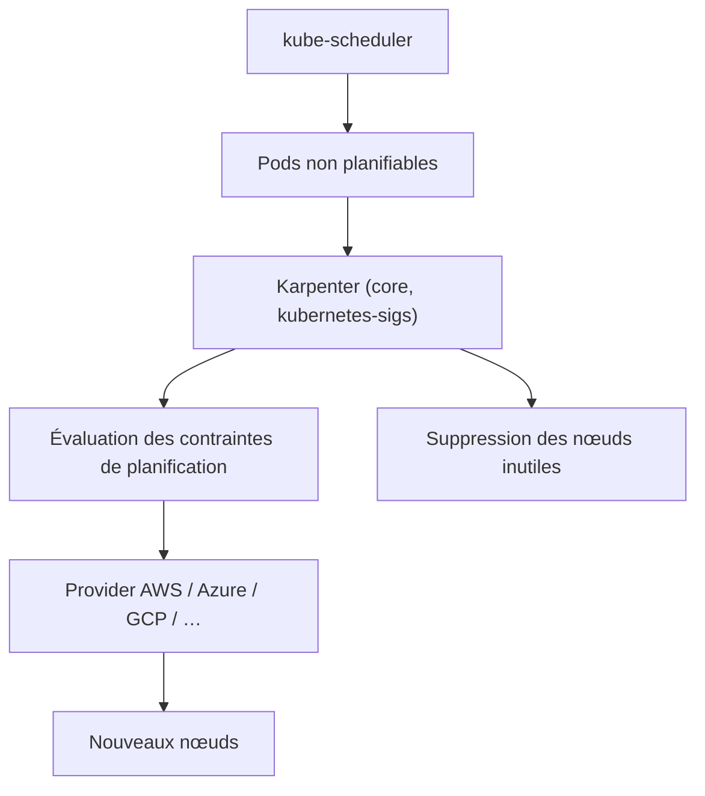

# kubernetes-sigs/karpenter

> Autoscaler de nœuds Kubernetes qui provisionne exactement ce que les pods en attente réclament.

## Le problème
Un cluster dimensionné par groupes de nœuds fixes gaspille de la capacité et laisse quand même
des pods non planifiables.

## Ce que ça fait vraiment
Quatre gestes, décrits tels quels dans le README : il **surveille** les pods que l'ordonnanceur
Kubernetes a marqués non planifiables, **évalue** leurs contraintes (demandes de ressources,
nodeSelectors, affinités, tolérances, contraintes de répartition topologique), **provisionne**
des nœuds qui satisfont ces exigences, et **supprime** ces nœuds quand ils ne servent plus.
C'est un projet multi-cloud : le cœur est ici, les implémentations sont chez les fournisseurs
— AWS, Azure, AlibabaCloud, GCP, Hetzner, IBM Cloud, Oracle (support officiel Oracle),
Proxmox, Exoscale, Cluster API, Akamai/Linode en alpha, UpCloud, et d'autres.

## Comment c'est branché

## Essayer
Aucune commande documentée : ce dépôt est le cœur multi-cloud, l'installation se fait via
l'implémentation du fournisseur (par exemple `aws/karpenter-provider-aws`).

## Coût et pièges
Le logiciel est gratuit ; ce qu'il provisionne ne l'est pas — c'est un outil qui crée des
machines chez un cloud, donc qui engage directement la facture. Le comportement réel dépend du
provider choisi, et plusieurs sont en alpha ou bêta ou maintenus par des tiers (Zoom pour OCI,
kubekanvas, upcloud-tools).

## Ce que ce n'est pas
Ce n'est pas le Cluster Autoscaler (le README renvoie à une conférence qui les compare). Ce
n'est pas un autoscaler de pods : il agit sur les nœuds. Et ce dépôt seul ne s'installe pas.

## Alternatives
- Kubernetes Cluster Autoscaler, l'approche par groupes de nœuds.
- `aws/karpenter-provider-aws` et les autres providers : ce sont les artefacts installables.

## Pour toi
Peu de rapport avec la data au quotidien, sauf si tu portes la facture GPU du cluster.
