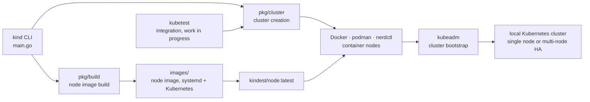

# kubernetes-sigs/kind

> **A throwaway Kubernetes cluster whose every node is a container, for testing and for CI.**

## The problem

Checking that a manifest, an operator or a chart behaves as expected requires a Kubernetes
cluster — so, without a local tool, a remote cluster to provision, pay for and share with
colleagues, or a virtual machine to set up by hand. And testing a change to Kubernetes *itself*,
or replaying a multi-node scenario inside a CI job, means being able to create and destroy that
cluster in moments, as many times as there are commits.

## What it actually does

kind runs local Kubernetes clusters using Docker containers as "nodes". Each node is an image
built to run systemd and Kubernetes; kind then bootstraps the cluster with `kubeadm`, the
official installation tool. The README states three uses: testing Kubernetes itself — the
original design target — local development, and CI.

The repository holds more than the command. It is made of Go packages (`pkg/cluster` for
cluster creation, `pkg/build` for image building), a command line interface (`main.go`) built
on those packages, node images (`images/`), and a `kubetest` integration described as work in
progress. In other words, cluster creation is usable as a library, not only from a terminal.

Four capabilities are claimed explicitly: multi-node clusters, including highly available ones;
building Kubernetes from source (through make/bash, through Docker, or from pre-published
builds) via `kind build node-image`; support for Linux, macOS and Windows; and the status of a
CNCF certified conformant Kubernetes installer. Advanced features and multi-node clusters are
described in a config file, documented outside the README.

## How it is wired



No code-derived diagram exists for this repository: this one is rebuilt from the README alone,
using the paths the README itself points at (`./pkg`, `./pkg/cluster`, `./pkg/build`,
`./main.go`, `./images`). The thing to take away is that the command line is only a front: the
logic lives in the Go packages, and `kubeadm` does the bootstrapping — kind supplies the
substrate (containers and node image), not the Kubernetes install itself.

## Trying it

The shortcut at the top of the README, if `go` and `docker`, `podman` or `nerdctl` are
installed:

```console
go install sigs.k8s.io/kind@v0.33.0 && kind create cluster
```

The published binary, on Linux:

```console
# For AMD64 / x86_64
[ $(uname -m) = x86_64 ] && curl -Lo ./kind https://kind.sigs.k8s.io/dl/v0.33.0/kind-$(uname)-amd64
# For ARM64
[ $(uname -m) = aarch64 ] && curl -Lo ./kind https://kind.sigs.k8s.io/dl/v0.33.0/kind-$(uname)-arm64
chmod +x ./kind
sudo mv ./kind /usr/local/bin/kind
```

On macOS: `brew install kind`, or `sudo port selfupdate && sudo port install kind`. On Windows:
`choco install kind`, or downloading `kind-windows-amd64.exe`.

The lifecycle, once Docker is running:

```console
kind create cluster
kind delete cluster
```

From Kubernetes source, after cloning Kubernetes into
`$(go env GOPATH)/src/k8s.io/kubernetes`:

```console
kind build node-image
kind create cluster --image kindest/node:latest
```

Without installing go, the repository builds with Docker through `make build`. The remaining
options are discovered with `kind [command] --help`.

## Cost and traps

- **Docker (or podman, or nerdctl) is mandatory**, and the README points to installing Docker
  as a prerequisite to any use. No containers, no nodes.
- **The go version matters**: the README asks for "the latest go" for `go install` and points
  at the repository's `.go-version` file for the exact version used in development.
- **The binary lands in `$(go env GOPATH)/bin`**: the `kind: command not found` error after
  installation is expected if that directory is not on `$PATH`. The README flags it and offers
  a manual install by cloning then `make build`.
- **For CI, the README explicitly recommends the stable binaries** from the releases page over
  `go install` — that is the path to favour in a pipeline.
- **Acknowledged status**: the README states in bold that kind is still a work in progress and
  points at a 1.0 roadmap. The project is widely used and CNCF certified conformant, but does
  not present itself as settled.
- **The useful documentation is not in the repository**: the very first README line redirects to
  `kind.sigs.k8s.io` for detailed installation and the user guide. The config file format,
  multi-node clusters and advanced features are not described here — hence the "insufficient
  material" flag: this page is a landing page, not documentation.
- **No monetary cost**: Apache-2.0, no account, no key, no third-party service. The real cost is
  the local machine, which hosts as many containers as nodes requested.

## What it is not

- **It is not a production cluster.** The nodes are containers on one machine: the advertised
  high availability is that of the control plane topology, not real fault tolerance. Lose the
  host and the whole "HA cluster" goes with it.
- **It is not a Kubernetes distribution.** kind does not reimplement installation: it prepares
  nodes and delegates bootstrapping to `kubeadm`. What runs inside is upstream Kubernetes, with
  networking and storage components to add yourself.
- **It is not a turnkey development environment.** No graphical interface, no built-in image
  registry documented here, no hot reload: the build-push-deploy loop still has to be wired
  around it.
- **The `kubetest` integration is announced as work in progress**: do not assume it is settled.

## Alternatives

No comparable alternative in the catalogue. The neighbours proposed for this repository
(`coder/coder`, remote development environments; `nucleuscloud/neosync`, data anonymisation;
`spegel-org/spegel`, a peer-to-peer image registry mirror inside a cluster;
`aquasecurity/tracee`, runtime security observation through eBPF) share the Kubernetes and
container vocabulary, but none creates a local cluster: they install *into* a cluster or beside
one, where kind manufactures one.

| | When to prefer it |
|---|---|
| **containerd/nerdctl** | Named in the README as one of the three accepted container engines, alongside Docker and podman — a part kind uses, not a competitor. Worth remembering if Docker cannot be installed on the machine. |
| **kubernetes/test-infra (`kubetest`)** | Named in the README: the Kubernetes test tooling, for which kind ships a work-in-progress integration. Prefer it when the need is orchestrating conformance test suites rather than creating a cluster. |

The README names no other local Kubernetes cluster tool, and nothing is to be invented here.

## For you

Useful as soon as data or MLOps work touches Kubernetes: validating a chart, an operator, a CRD,
a `PersistentVolumeClaim` or a training job without consuming a shared cluster, and repeating
the exact same steps in CI. The `kind create cluster` / `kind delete cluster` pair makes
Kubernetes integration tests reproducible for the price of a container, which is the real
argument. Skip it if the target is anything other than Kubernetes, or if the work machine
cannot run Docker.
