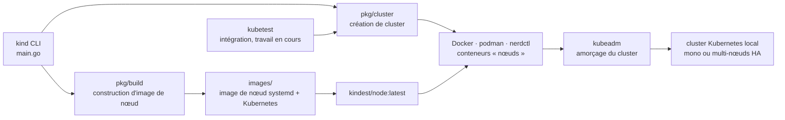

# kubernetes-sigs/kind

> **Un cluster Kubernetes jetable dont chaque nœud est un conteneur, pour tester et pour la CI.**

## Le problème

Vérifier qu'un manifeste, un opérateur ou un chart se comporte comme prévu demande un cluster
Kubernetes — donc, sans outil local, un cluster distant qu'il faut provisionner, payer et
partager entre collègues, ou une machine virtuelle à monter à la main. Et tester une
modification de Kubernetes *lui-même*, ou rejouer un scénario multi-nœuds dans un job de CI,
suppose de pouvoir créer et détruire ce cluster en quelques instants, autant de fois qu'il y a
de commits.

## Ce que ça fait vraiment

kind crée des clusters Kubernetes locaux en utilisant des conteneurs Docker comme « nœuds ».
Chaque nœud est une image conçue pour faire tourner systemd et Kubernetes ; kind amorce ensuite
le cluster avec `kubeadm`, l'outil d'installation officiel. Le README annonce trois usages :
tester Kubernetes lui-même — la cible de conception d'origine —, le développement local et la CI.

Le dépôt contient plus que la commande. Il est fait de paquets Go (`pkg/cluster` pour la
création de cluster, `pkg/build` pour la construction d'images), d'une interface en ligne de
commande (`main.go`) bâtie sur ces paquets, des images de nœuds (`images/`), et d'une
intégration `kubetest` annoncée comme en cours de travail. Autrement dit, la création de
cluster est utilisable comme bibliothèque, pas seulement depuis le terminal.

Quatre capacités sont revendiquées explicitement : les clusters multi-nœuds, y compris en haute
disponibilité ; la construction de Kubernetes depuis les sources (via make/bash, via Docker, ou
depuis des binaires déjà publiés) grâce à `kind build node-image` ; le support de Linux, macOS
et Windows ; et le statut d'installateur Kubernetes conforme certifié CNCF. Les fonctions
avancées et les clusters multi-nœuds se décrivent dans un fichier de configuration, documenté
hors du README.

## Comment c'est branché



Aucun diagramme tiré du code n'existe pour ce dépôt : ce schéma est reconstruit depuis le seul
README, à partir des chemins qu'il désigne lui-même (`./pkg`, `./pkg/cluster`, `./pkg/build`,
`./main.go`, `./images`). Le point à retenir est que la ligne de commande n'est qu'une façade :
la logique vit dans les paquets Go, et `kubeadm` fait l'amorçage — kind fournit le substrat
(conteneurs et image de nœud), pas l'installation de Kubernetes elle-même.

## Essayer

Le raccourci donné en tête de README, si `go` et `docker`, `podman` ou `nerdctl` sont installés :

```console
go install sigs.k8s.io/kind@v0.33.0 && kind create cluster
```

Le binaire publié, sur Linux :

```console
# For AMD64 / x86_64
[ $(uname -m) = x86_64 ] && curl -Lo ./kind https://kind.sigs.k8s.io/dl/v0.33.0/kind-$(uname)-amd64
# For ARM64
[ $(uname -m) = aarch64 ] && curl -Lo ./kind https://kind.sigs.k8s.io/dl/v0.33.0/kind-$(uname)-arm64
chmod +x ./kind
sudo mv ./kind /usr/local/bin/kind
```

Sur macOS : `brew install kind`, ou `sudo port selfupdate && sudo port install kind`. Sur
Windows : `choco install kind`, ou le téléchargement de `kind-windows-amd64.exe`.

Le cycle de vie, une fois Docker en marche :

```console
kind create cluster
kind delete cluster
```

Depuis les sources de Kubernetes, après avoir cloné Kubernetes dans
`$(go env GOPATH)/src/k8s.io/kubernetes` :

```console
kind build node-image
kind create cluster --image kindest/node:latest
```

Sans installer go, le dépôt se construit avec Docker par `make build`. Le reste des options se
découvre par `kind [command] --help`.

## Coût et pièges

- **Docker (ou podman, ou nerdctl) est obligatoire**, et le README renvoie à l'installation de
  Docker comme préalable à tout usage. Pas de conteneurs, pas de nœuds.
- **La version de go compte** : le README demande « la dernière go » pour `go install` et
  renvoie au fichier `.go-version` du dépôt pour la version exacte utilisée en développement.
- **Le binaire atterrit dans `$(go env GOPATH)/bin`** : l'erreur `kind: command not found`
  après installation est attendue si ce répertoire n'est pas dans le `$PATH`. Le README le
  signale et propose l'installation manuelle par clone puis `make build`.
- **Pour la CI, le README recommande explicitement les binaires stables** de la page des
  releases plutôt que `go install` — c'est le chemin à privilégier dans un pipeline.
- **Statut assumé** : le README indique en gras que kind reste un travail en cours et renvoie à
  une feuille de route 1.0. Le projet est largement utilisé et certifié conforme par la CNCF,
  mais ne se présente pas comme stabilisé.
- **La documentation utile n'est pas dans le dépôt** : la toute première ligne du README
  redirige vers `kind.sigs.k8s.io` pour l'installation détaillée et le guide utilisateur. Le
  format du fichier de configuration, les clusters multi-nœuds et les fonctions avancées n'y
  sont pas décrits — d'où l'alerte « matière insuffisante » : la fiche ne peut s'appuyer que
  sur une page d'accueil, pas sur une documentation.
- **Aucun coût monétaire** : Apache-2.0, pas de compte, pas de clé, pas de service tiers. Le
  coût réel est la machine locale, qui héberge autant de conteneurs que de nœuds demandés.

## Ce que ce n'est pas

- **Ce n'est pas un cluster de production.** Les nœuds sont des conteneurs sur une seule
  machine : la haute disponibilité annoncée est celle de la topologie du plan de contrôle, pas
  une tolérance aux pannes réelle. Perdre l'hôte, c'est perdre le « cluster HA » en entier.
- **Ce n'est pas une distribution Kubernetes.** kind ne réimplémente pas l'installation : il
  prépare des nœuds et délègue l'amorçage à `kubeadm`. Ce qui tourne dedans est du Kubernetes
  amont, avec les composants réseau et stockage qu'il faut ajouter soi-même.
- **Ce n'est pas un environnement de développement clés en main.** Pas d'interface graphique,
  pas de registre d'images intégré documenté ici, pas de rechargement à chaud : la boucle
  construire-pousser-déployer reste à câbler autour.
- **L'intégration `kubetest` est annoncée comme en cours de travail** : ne pas la supposer
  acquise.

## Alternatives

Aucune alternative comparable dans le catalogue. Les voisins proposés pour ce dépôt
(`coder/coder`, environnements de développement distants ; `nucleuscloud/neosync`, anonymisation
de données ; `spegel-org/spegel`, miroir de registre d'images pair-à-pair dans un cluster ;
`aquasecurity/tracee`, observation de la sécurité à l'exécution par eBPF) partagent le
vocabulaire Kubernetes et conteneurs, mais aucun ne crée de cluster local : ils s'installent
*dans* un cluster ou à côté, là où kind en fabrique un.

| | Quand le préférer |
|---|---|
| **containerd/nerdctl** | Nommé dans le README comme l'un des trois moteurs de conteneurs acceptés, aux côtés de Docker et podman — c'est une pièce que kind utilise, pas un concurrent. À retenir si Docker n'est pas installable sur le poste. |
| **kubernetes/test-infra (`kubetest`)** | Nommé dans le README : l'outillage de test de Kubernetes, dont kind fournit une intégration en cours de travail. À préférer quand le besoin est d'orchestrer des suites de tests de conformité plutôt que de créer un cluster. |

Le README ne nomme aucun autre outil de cluster Kubernetes local, et rien n'est à inventer ici.

## Pour toi

Utile dès qu'un travail data ou MLOps touche à Kubernetes : valider un chart, un opérateur, un
CRD, un `PersistentVolumeClaim` ou un job d'entraînement sans consommer de cluster partagé, et
refaire la manipulation à l'identique dans la CI. Le couple `kind create cluster` /
`kind delete cluster` rend les tests d'intégration Kubernetes reproductibles pour le prix d'un
conteneur, ce qui est le vrai argument. À passer si la cible est ailleurs que Kubernetes, ou si
la machine de travail ne peut pas faire tourner Docker.
