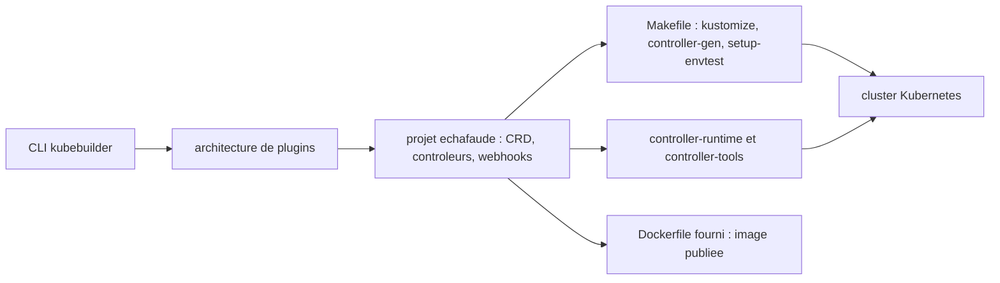

# kubernetes-sigs/kubebuilder

> **Scaffolding for Kubernetes APIs in Go**, for people writing CRDs, controllers and webhooks.

## The problem

Writing a Kubernetes API by hand means, in the README's words, many decisions and a lot of
boilerplate: declaring CRDs, wiring reconcile loops, setting up integration tests, shipping an
image. Without a framework every operator project redoes that work its own way and stays
exposed to breaking changes in the low-level client libraries.

## What it actually does

Kubebuilder is a framework for building Kubernetes APIs from custom resource definitions, which
the README compares to Ruby on Rails and SpringBoot. It initialises a project, generates
resources and controllers, and layers abstractions on top of `controller-runtime` and
`controller-tools`. A plugin architecture adds optional helpers: the Deploy Image plugin, named
in the README, scaffolds the API and controller that deploy and manage an operand image on the
cluster. It is also usable as a library — the README points to Operator-SDK, which relies on
the plugin feature for its Ansible and Helm based operators. Code generation is driven off
`// +` comments. The README calls its libraries "powerful"; that wording is promotional and is
not repeated here.

## How it is wired



The README lays out the intended flow: create a project directory, declare one or more APIs as
CRDs and add fields, implement reconcile loops in controllers, test against a cluster (CRDs
self-install and controllers start automatically), extend the bootstrapped integration tests,
then build and publish a container from the provided Dockerfile. Generated projects carry a
`Makefile` that installs kustomize, controller-gen and setup-envtest at pinned versions, plus a
`go.mod` pinning dependency versions.

## Trying it

```
# The README contains no runnable commands: it points to released binaries on the
# releases page and to the book's quick-start instructions.
```

No copyable command line appears in the README. It strongly recommends using a released
version, links the releases page for binaries, and defers installation and first steps to
`book.kubebuilder.io`.

## Cost and traps

Nothing to pay: Apache-2.0, hosted under kubernetes-sigs. The real cost is elsewhere. You need
a Kubernetes cluster to test against and a Go toolchain; the minimum Go version follows the
`k8s.io/*` dependencies (the README's example: Go 1.22 for release 4.1.1). Each Kubebuilder
minor version is tested against one specific client-go minor version, and compatibility beyond
that is neither guaranteed nor supported. Only macOS and Linux are officially supported;
Windows users are sent to `docs/windows.md`, and the README states Windows support is not
planned.

## What it is not

It is not an example to copy-paste — the README says so explicitly. It is not a replacement for
`controller-runtime` or `controller-tools`, which it is built on and whose version constraints
it inherits. It is not multi-language: the declared scope is Go, and Ansible or Helm operators
go through Operator-SDK. It is not a Windows tool, and the README documents no command at all —
the whole onboarding lives in a separate book.

## Alternatives

The README names Operator-SDK (operator-framework/operator-sdk) as a project consuming
Kubebuilder as a library, and therefore the entry point if you want non-Go operators. It also
cites controller-runtime and controller-tools, the underlying layers you can use directly to
skip the scaffolding. Among the supplied neighbours, kubernetes-client/python and etcd-io/etcd
belong to the same ecosystem but answer a different need; no other comparable alternative in
the catalogue.

## For you

Relevant if you run ML workloads on Kubernetes and want your abstractions — training jobs,
model servers, pipelines — exposed as native resources rather than scripts. This is the
canonical path to writing an operator in Go, and the investment is mostly learning Go and the
reconciliation model. Outside that case, a Helm chart stays cheaper.
