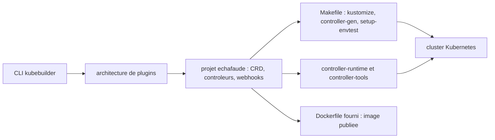

# kubernetes-sigs/kubebuilder

> **Échafaudage d'API Kubernetes en Go** pour qui écrit des CRD, des contrôleurs et des webhooks.

## Le problème

Écrire une API Kubernetes à la main demande, selon le README, « beaucoup de décisions et
beaucoup de boilerplate » : définir les CRD, câbler les boucles de réconciliation, monter les
tests d'intégration, produire l'image. Sans cadre, chaque projet d'opérateur refait ce travail
à sa façon et se retrouve exposé aux changements des bibliothèques client bas niveau.

## Ce que ça fait vraiment

Kubebuilder est un framework de construction d'API Kubernetes à base de CRD, comparé dans le
README à Ruby on Rails ou SpringBoot. Il initialise un projet, génère les ressources et les
contrôleurs, et fournit des abstractions bâties au-dessus de `controller-runtime` et
`controller-tools`. Son architecture à plugins permet d'ajouter des aides optionnelles : le
plugin Deploy Image, cité par le README, génère l'API et le contrôleur qui déploient et gèrent
une image sur le cluster. Il se veut aussi utilisable comme bibliothèque : le README donne
Operator-SDK en exemple de projet qui s'en sert, notamment via les plugins pour ses opérateurs
Ansible et Helm. La génération de code est pilotée par des commentaires `// +`. Le README
emploie l'adjectif « powerful » pour ses bibliothèques — vocabulaire promotionnel, non repris ici.

## Comment c'est branché



Le README décrit le flux attendu : créer un répertoire de projet, déclarer une ou plusieurs
API en CRD et leurs champs, implémenter les boucles de réconciliation dans les contrôleurs,
tester contre un cluster (les CRD s'installent et les contrôleurs démarrent automatiquement),
compléter les tests d'intégration générés, puis construire et publier un conteneur à partir du
Dockerfile fourni. Les projets générés embarquent un `Makefile` qui installe kustomize,
controller-gen et setup-envtest à des versions figées, plus un `go.mod` qui épingle les
dépendances.

## Essayer

```
# Aucune commande n'est écrite dans le README : il renvoie aux binaires publiés
# sur la page des releases et aux instructions du livre (quick-start.html).
```

Le README ne documente aucune ligne de commande copiable. Il recommande explicitement de
partir d'une version publiée, pointe la page des releases pour les binaires, et renvoie au
Getting Started du livre `book.kubebuilder.io` pour l'installation et le démarrage.

## Coût et pièges

Rien à payer : projet Apache-2.0 hébergé sous kubernetes-sigs. Le coût réel est ailleurs. Il
faut un cluster Kubernetes pour tester, et une chaîne Go : la version minimale de Go dépend de
celle qu'exigent les dépendances `k8s.io/*` (exemple donné : Go 1.22 pour la release 4.1.1).
Chaque version mineure de Kubebuilder n'est testée qu'avec une version mineure précise de
client-go ; la compatibilité avec d'autres n'est ni garantie ni supportée. Seuls macOS et Linux
sont officiellement supportés, Windows renvoie à `docs/windows.md` et le README indique que
son support n'est pas prévu.

## Ce que ce n'est pas

Ce n'est pas un exemple à copier-coller : le README le dit noir sur blanc. Ce n'est pas non
plus un remplaçant de `controller-runtime` ou `controller-tools`, sur lesquels il est bâti et
dont il hérite les contraintes de version. Ce n'est pas une solution multi-langages : le
périmètre déclaré est Go, les opérateurs Ansible et Helm passent par Operator-SDK. Enfin ce
n'est pas un outil Windows, et le README ne documente pas la moindre commande — toute la prise
en main vit dans un livre séparé.

## Alternatives

Le README nomme Operator-SDK (operator-framework/operator-sdk) comme consommateur de
Kubebuilder en tant que bibliothèque, et donc comme porte d'entrée si l'on veut des opérateurs
non-Go. Il cite aussi controller-runtime et controller-tools, les couches sous-jacentes que
l'on peut utiliser directement pour se passer de l'échafaudage. Parmi les voisins fournis,
kubernetes-client/python et etcd-io/etcd touchent au même écosystème mais ne répondent pas au
même besoin ; aucune autre alternative comparable dans le catalogue.

## Pour toi

Pertinent si tu opères des charges ML sur Kubernetes et que tu veux exposer tes abstractions
(jobs d'entraînement, serveurs de modèles, pipelines) comme des ressources natives plutôt que
comme des scripts. C'est le chemin canonique pour écrire un opérateur en Go, et l'investissement
se mesure surtout en apprentissage de Go et du modèle de réconciliation. Hors de ce cas, un
Helm chart reste moins coûteux.
