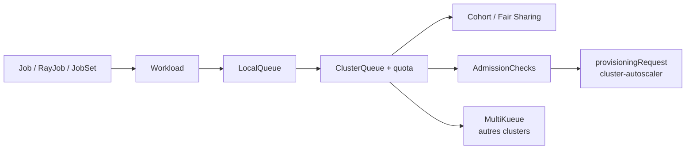

# kubernetes-sigs/kueue

> Contrôleur de file d'attente de jobs Kubernetes, pour équipes qui partagent des GPU entre workloads.

## Le problème
Sans gestionnaire au niveau job, des pods s'admettent en désordre et se disputent le quota.
Rien ne décide quand un job doit démarrer, s'arrêter, ou céder sa place à un job prioritaire.

## Ce que ça fait vraiment
Décide de l'admission d'un job (création des pods) et de son arrêt, avec priorités
`StrictFIFO` ou `BestEffortFIFO`. Gestion avancée des ressources : fongibilité des flavors,
Fair Sharing, cohorts, politiques de préemption entre tenants.
Intégrations natives : BatchJob, jobs Kubeflow, RayJob, RayCluster, JobSet, Pod et groupes de Pods.
AdmissionChecks pour brancher un composant externe, intégration au `provisioningRequest` du
cluster-autoscaler, all-or-nothing avec timeout, admission partielle et récupération dynamique de quota,
cohabitation batch et serving, MultiKueue pour le dispatch multi-cluster, ordonnancement conscient
de la topologie du datacenter.

## Comment c'est branché


## Essayer
```bash
kubectl apply --server-side -f https://github.com/kubernetes-sigs/kueue/releases/download/v0.19.5/manifests.yaml
kubectl apply -f examples/admin/single-clusterqueue-setup.yaml
kubectl create -f examples/jobs/sample-job.yaml
```

## Coût et pièges
Gratuit. Testé et supporté officiellement sur Kubernetes 1.34 ou plus récent ; le contrôleur tourne
dans le namespace `kueue-system`. API en `v1beta2` : encore en évolution, même si le projet respecte
la politique de dépréciation Kubernetes et sort tous les 2–3 mois.

## Ce que ce n'est pas
Ce n'est pas un ordonnanceur de pods : il décide de l'admission des jobs, `kube-scheduler` place ensuite.
Ce n'est pas un gestionnaire de workflows : pas de dépendances entre étapes.
Ce n'est pas un autoscaler, il s'y intègre.

## Alternatives
Aucune nommée ; KueueViz est cité comme visualisation du projet.

## Pour toi
Le bon outil si tu partages un parc GPU entre entraînements : le quota par ClusterQueue règle les conflits.
