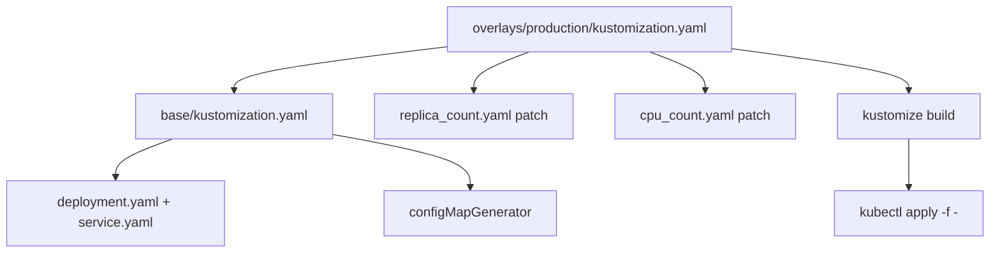

# kubernetes-sigs/kustomize

> Personnalisation de YAML Kubernetes sans template, par bases et surcouches, pour tout utilisateur de kubectl.

## Le problème
Décliner un même déploiement en dev, staging et production pousse soit à dupliquer les YAML, soit à les templatiser.
Dans les deux cas, récupérer les améliorations de l'amont devient pénible.

## Ce que ça fait vraiment
Un fichier `kustomization.yaml` déclare des `resources` et les personnalisations à leur appliquer : labels communs, `configMapGenerator`, patches.
`kustomize build` émet le YAML final, sans toucher aux fichiers d'origine, prêt pour `kubectl apply -f -`.
Les variantes se font par surcouches : un dossier `overlays/production` référence `../../base` et liste ses patches (`replica_count.yaml`, `cpu_count.yaml`).
Comme les ressources ne sont jamais modifiées, un fork peut se rebaser sur l'amont.

## Comment c'est branché


## Essayer
```sh
kubectl version --client
kustomize build ~/someApp
kustomize build ~/someApp | kubectl apply -f -
kustomize build ~/someApp/overlays/production
```

## Coût et pièges
Gratuit ; le binaire est déjà embarqué dans `kubectl`, mais à une version en retard — le tableau du README montre le décalage (kubectl v1.27 → kustomize v5.0.1).
Piège classique : le `kustomize` de `kubectl` et le binaire autonome n'ont pas le même comportement selon les versions.

## Ce que ce n'est pas
Pas un moteur de templates : il n'y a ni variables ni conditions, c'est un éditeur de texte déclaratif comparé à `sed` par le README.
Pas un gestionnaire de releases : aucune notion d'historique ni de rollback, contrairement à Helm.
Pas un outil d'application : il émet du YAML, `kubectl` fait le reste.

## Alternatives
- make : comparaison revendiquée dans le README pour le côté déclaratif, pas un substitut réel.
- kubectl : intègre le flux `kustomize build` si vous n'avez pas besoin de la dernière version.

## Pour toi
Utile dès que tu déploies un service de ML sur Kubernetes en plusieurs environnements sans vouloir de Helm.
