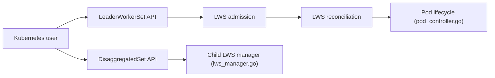

# kubernetes-sigs/lws

> API Kubernetes pour déployer un groupe de pods comme unité, pour l'inférence multi-nœuds.

## Le problème
Servir un LLM découpé sur plusieurs nœuds exige que leader et workers soient créés, mis à jour et redémarrés ensemble.

## Ce que ça fait vraiment
LeaderWorkerSet : un groupe leader plus workers forme une réplique, avec identité par index, création parallèle, placement topologique, ordonnancement tout-ou-rien (alpha), mise à jour par groupe et redémarrage complet en cas d'échec. DisaggregatedSet gère plusieurs rôles (par ex. prefill et decode) en lockstep. Des webhooks valident et complètent les ressources.

## Comment c'est branché


## Essayer
```bash
# Le README renvoie au guide d'installation et aux exemples ; aucune commande n'y figure
```

## Coût et pièges
Gratuit, mais l'intérêt suppose un cluster avec accélérateurs. Gang scheduling en alpha, API susceptible de changer. Compatible TPU d'après le code.

## Ce que ce n'est pas
Pas un serveur d'inférence : c'est le plan de déploiement. Il faut un serveur de modèle par-dessus.

## Alternatives
Aucune alternative nommée dans le README (co-conçu avec llm-d).

## Pour toi
À adopter si tu sers de gros modèles multi-nœuds sur Kubernetes : API standard d'un sous-projet officiel, activité récente.

