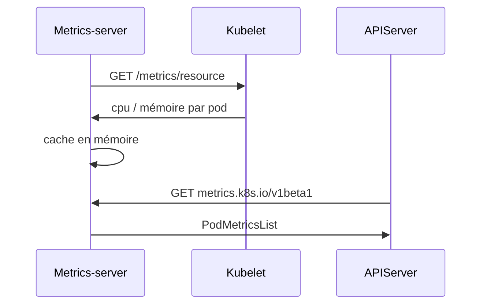

# kubernetes-sigs/metrics-server

> Source scalable de métriques CPU/mémoire pour l'autoscaling intégré de Kubernetes.

## Le problème
Le HPA/VPA et `kubectl top` ont besoin de métriques de ressources fraîches par nœud et pod. Sans source dédiée, l'autoscaling n'a pas de signal.

## Ce que ça fait vraiment
Collecte les métriques de ressources depuis les Kubelets et les expose via la Metrics API de l'apiserver, pour HPA, VPA et `kubectl top`. Un déploiement unique, collecte toutes les 15 s, ~1 millicore CPU et 2 Mo par nœud, jusqu'à 5 000 nœuds. Installation par manifeste YAML ou chart Helm, mode haute disponibilité.

## Comment c'est branché


## Essayer
```shell
kubectl apply -f https://github.com/kubernetes-sigs/metrics-server/releases/latest/download/components.yaml
```

## Coût et pièges
Gratuit. Exige aggregation layer activé, auth webhook des nœuds, certificat Kubelet signé par le CA du cluster (ou `--kubelet-insecure-tls` pour tests). Capacité `CAP_NET_BIND_SERVICE` requise.

## Ce que ce n'est pas
**Uniquement pour l'autoscaling** : pas une solution de monitoring, ni une source précise de métriques. Pour ça, Prometheus.

## Alternatives
- Prometheus : monitoring complet, quand on a besoin de plus que l'autoscaling.
- kubernetes/kube-state-metrics : métriques d'état des objets (complémentaire).

## Pour toi
Brique d'infra standard ; pertinent seulement si tu opères des charges ML sur Kubernetes avec autoscaling.
