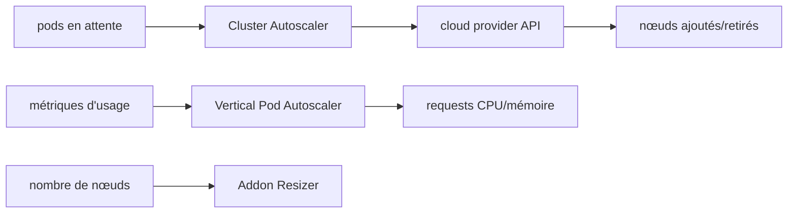

# kubernetes/autoscaler

> Dépôt monolithique des composants d'autoscaling Kubernetes : cluster, pods verticaux, addons.

## Le problème
Sans autoscaling, un cluster garde des nœuds inutiles ou laisse des pods sans place, et les requests CPU/mémoire restent devinées à la main.

## Ce que ça fait vraiment
Cluster Autoscaler ajuste la taille du cluster pour que tous les pods aient une place et qu'aucun nœud ne soit inutile ; GA depuis Kubernetes 1.8, plusieurs clouds publics supportés.
Vertical Pod Autoscaler ajuste automatiquement les requests CPU et mémoire des pods ; état bêta.
Addon Resizer, version simplifiée du VPA, modifie les requests d'un déploiement selon le nombre de nœuds ; état bêta.
Chacun des deux autoscalers dispose d'un chart Helm supporté.

## Comment c'est branché


## Essayer
```shell
mkdir -p $GOPATH/src/k8s.io
cd $GOPATH/src/k8s.io
git clone https://github.com/$YOUR_GITHUB_USERNAME/autoscaler.git
cd autoscaler
```

## Coût et pièges
Gratuit. Le code doit impérativement être cloné sous `k8s.io` et non `github.com`, sinon la compilation échoue. Le README ne documente aucune commande d'installation : il faut passer par les charts Helm ou la doc de chaque sous-composant.

## Ce que ce n'est pas
Pas un produit unique : trois composants distincts, à des maturités différentes (GA pour le Cluster Autoscaler, bêta pour VPA et Addon Resizer). Pas d'autoscaling horizontal des pods ici, c'est le HPA du cœur de Kubernetes. Le README est un index, l'essentiel est dans les sous-répertoires.

## Alternatives
Aucune alternative nommée dans le README.

## Pour toi
Le Cluster Autoscaler est la brique à connaître si tu fais tourner des jobs d'entraînement à charge variable sur Kubernetes.
