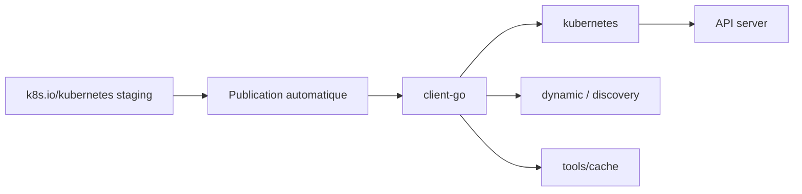

# kubernetes/client-go

> Clients Go officiels pour parler à l'API Kubernetes, publiés automatiquement depuis le dépôt principal.

## Le problème
Écrire un contrôleur ou un outil qui dialogue avec l'API Kubernetes en HTTP brut suppose de réimplémenter
typage, découverte d'API, authentification et cache d'objets.

## Ce que ça fait vraiment
Fournit le paquet `kubernetes` (clientset typé), `discovery` (découverte des API supportées par un serveur),
`dynamic` (opérations génériques sur des objets arbitraires), `plugin/pkg/client/auth` (plugins
d'authentification externes), `transport` (auth et connexion) et `tools/cache`, la base pour écrire des
contrôleurs. Versionnage : majeure figée à `0`, une branche et un tag par version mineure de Kubernetes,
plus des tags `kubernetes-1.x.y` miroirs du dépôt principal.

## Comment c'est branché


## Essayer
```bash
go get k8s.io/client-go@latest
go get k8s.io/client-go@v0.20.4
```

## Coût et pièges
Gratuit. Go 1.16 ou plus récent pour `@latest`. Les tags `v0.x.y` signalent que les API Go **peuvent
changer de façon incompatible** d'une version à l'autre ; le tag de version Kubernetes ne garantit
aucune compatibilité ascendante. Les branches antérieures à `release-1.31` sont dépréciées ou en
maintenance manuelle limitée aux failles graves.

## Ce que ce n'est pas
Pas un dépôt de contribution : il est en lecture seule, issues et PR vont dans `kubernetes/kubernetes`.
Pas un framework de contrôleur : `tools/cache` est une brique, pas un échafaudage complet.
Aucune licence indiquée dans ce README.

## Alternatives
Aucun dépôt alternatif n'est nommé dans le README.

## Pour toi
Le passage obligé si tu écris un opérateur Go ; sinon `kubectl` suffit.
