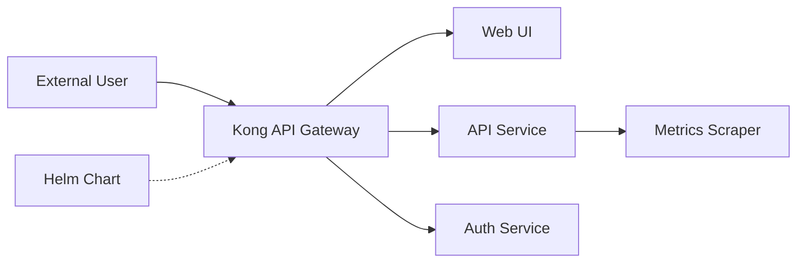

# kubernetes/dashboard

> Interface web généraliste pour gérer et dépanner un cluster Kubernetes ; README annonce l'archivage.

## Le problème
Voir et administrer les ressources d'un cluster sans tout faire en ligne de commande.

## Ce que ça fait vraiment
Déploiement uniquement via Helm depuis la version 7 : plusieurs conteneurs (API Go, Auth, metrics-scraper, Web Angular) derrière une passerelle Kong. Le README affiche en tête que le projet est archivé faute de mainteneurs et recommande Headlamp.

## Comment c'est branché


## Essayer
```bash
helm repo add kubernetes-dashboard https://kubernetes.github.io/dashboard/
helm upgrade --install kubernetes-dashboard kubernetes-dashboard/kubernetes-dashboard --create-namespace --namespace kubernetes-dashboard
```

## Coût et pièges
Contradiction : le README parle d'archivage alors que le catalogue indique « archivé : non ». Un cluster et Helm sont nécessaires. Plus de support d'installation par manifeste.

## Ce que ce n'est pas
Pas maintenu selon son propre README ; pas un outil de suivi ML.

## Alternatives
- Headlamp : recommandé par le README, désormais sous sig-ui.

## Pour toi
À ignorer : le README annonce l'arrêt de la maintenance ; pars sur Headlamp pour une UI Kubernetes.
