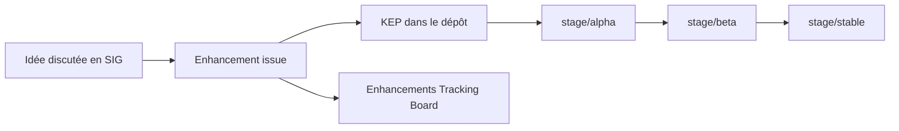

# kubernetes/enhancements

> Dépôt de suivi des évolutions de Kubernetes : issues parapluie et KEP par fonctionnalité.

## Le problème
Une évolution de Kubernetes s'étale sur plusieurs versions et plusieurs SIG.
Sans registre commun, personne ne peut vérifier que tests, docs et revues ont suivi.

## Ce que ça fait vraiment
Héberge les issues de suivi et les KEP ; propriété du SIG Architecture.
Donne les heuristiques pour savoir si un changement est une « enhancement » — et quand ce n'en est pas une.
Définit quand ouvrir une issue : idée déjà discutée, personnes identifiées, disponibilité de neuf mois à un an.
Trois étapes Alpha, Beta, Stable, avec une liste de contrôle et des approbateurs différents par aspect.

## Comment c'est branché

## Essayer
Aucune commande documentée : c'est un dépôt de processus, pas un logiciel.

## Coût et pièges
Gratuit. Le coût réel est humain : neuf mois à un an d'engagement pour mener une évolution jusqu'à Stable.
Les commentaires de conception ne vont pas sur l'issue de suivi mais sur une issue ou PR dédiée.

## Ce que ce n'est pas
Pas du code : aucune implémentation ici.
Pas une feuille de route produit — ce qui est listé n'est pas garanti de sortir.
Pas un lieu de débat technique sur le design.

## Alternatives
Aucune alternative nommée dans le README.

## Pour toi
Sans intérêt direct pour un poste data ; à ouvrir seulement pour anticiper une API Kubernetes qui bouge.
