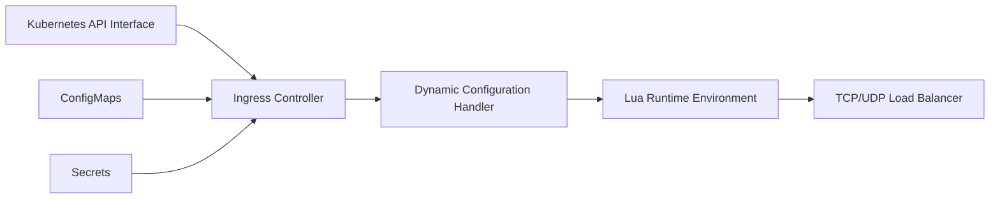

# kubernetes/ingress-nginx

> Contrôleur Ingress Kubernetes basé sur NGINX, retiré et archivé depuis mars 2026.

## Le problème
Exposer des services d'un cluster Kubernetes à l'extérieur demande un reverse proxy qui suive dynamiquement les objets Ingress, certificats et services.

## Ce que ça fait vraiment
Le contrôleur surveille l'API Kubernetes (Ingress, ConfigMaps, Secrets) et reconfigure NGINX en conséquence.
NGINX sert de reverse proxy et de répartiteur de charge, avec modules Lua pour la configuration dynamique.
Webhook d'admission, métriques, TCP/UDP (architecture).
Plus aucune release, correctif ni mise à jour de sécurité après mars 2026.

## Comment c'est branché

## Essayer
Aucune commande documentée dans le README, qui ne contient plus que l'avis de retrait.

## Coût et pièges
Gratuit, mais failles futures non corrigées. Les images et charts Helm restent disponibles, ce qui peut tromper.

## Ce que ce n'est pas
Pas adapté aux clusters multi-tenant : il suppose que qui crée un Ingress est administrateur. Plus un choix pour un nouveau déploiement.

## Alternatives
- Une implémentation de Gateway API : recommandation explicite du README.

## Pour toi
À ignorer : dépôt archivé ; si tes clusters d'inférence l'utilisent encore, planifie la migration vers Gateway API.
