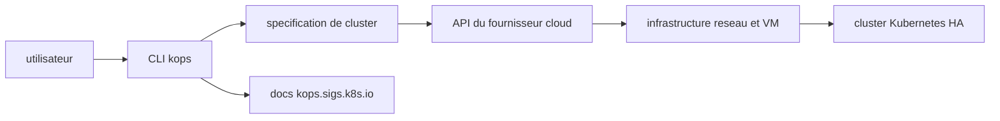

# kubernetes/kops

> **Command line tool that creates and maintains Kubernetes clusters on a cloud provider, for infra teams.**

## The problem

Without it, standing up your own Kubernetes cluster means provisioning the network, the
machines and the control plane by hand at your cloud provider, then redoing that work at
every upgrade or node replacement. The README states the problem in one line: getting a
production grade Kubernetes cluster without assembling the plumbing yourself.

## What it actually does

The README calls kOps "`kubectl` for clusters". It creates, destroys, upgrades and maintains
a highly available Kubernetes cluster, and — the part that sets it apart from a plain
installer — also provisions the cloud infrastructure that cluster needs. It does not replace
Kubernetes: it installs it and manages its lifecycle. Providers listed in the README: AWS and
GCP officially supported, DigitalOcean, Hetzner and OpenStack in beta, Azure in alpha. The
internals are not documented in the README, which points to `kops.sigs.k8s.io` and the
repository's `/docs` directory.

## How it is wired



Reading the diagram, strictly within what the README supports: the user drives a CLI, that
CLI describes a cluster and calls the cloud provider API to provision infrastructure, on top
of which the Kubernetes cluster is installed; the same commands later upgrade or destroy it.
The README names no internal file or component, and no code-derived diagram exists for this
repository, so the detail stops there.

## Trying it

```bash
# no install or launch command is written in the README
# it points to the Getting Started page: https://kops.sigs.k8s.io/getting_started/install/
```

The README carries no reproducible command block — only an asciinema recording and links to
the documentation. Nothing has been reconstructed here.

## Cost and traps

The tool itself is free and open source, but it does not run on nothing: you need an account
with a cloud provider (AWS, GCP, DigitalOcean, Hetzner, OpenStack or Azure), and the machines
it provisions are billed by that provider, not by the project. Second trap, documented in the
README: support levels differ a lot per provider — official for AWS and GCP, beta for three
others, alpha for Azure — which is not the same promise from one cloud to the next. Finally,
kOps-to-Kubernetes version compatibility has its own page: check it before any upgrade.

## What it is not

It is not a local Kubernetes or a development sandbox: kOps talks to a cloud API and creates
real, billed resources. It is not a managed service either — you keep ownership of the control
plane and its operation, where EKS or GKE would take that off your hands. And it is not a
general purpose infrastructure tool: its scope is the Kubernetes cluster and what it needs
around it, nothing else.

## Alternatives

The README names no competing project. Among the provided neighbours, `kubernetes/minikube`
is the useful counterpoint: a single machine local cluster for learning or testing, where
kOps targets a durable cloud cluster. `etcd-io/etcd` and `containerd/containerd` are not
alternatives but building blocks Kubernetes uses underneath; `goharbor/harbor` (an image
registry) answers a different need entirely.

## For you

Relevant if you operate the cluster hosting your training jobs or inference services yourself
and refuse the managed route — kOps makes the cluster lifecycle reproducible. Skip it if your
platform is already a managed EKS/GKE, or if you just want a throwaway local cluster.
