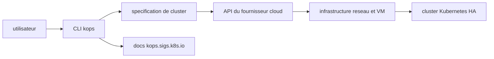

# kubernetes/kops

> **Ligne de commande qui crée et entretient des clusters Kubernetes chez un fournisseur cloud, pour équipes infra.**

## Le problème

Sans lui, monter un cluster Kubernetes en propre oblige à provisionner à la main le réseau,
les machines et le plan de contrôle chez le fournisseur cloud, puis à refaire ce travail à
chaque mise à niveau ou remplacement de nœud. Le README pose le problème en une phrase :
obtenir un cluster Kubernetes de qualité production sans assembler soi-même la tuyauterie.

## Ce que ça fait vraiment

Le README décrit kOps comme « `kubectl` pour les clusters ». L'outil crée, détruit, met à
niveau et maintient un cluster Kubernetes hautement disponible, et — c'est le point qui le
distingue d'un simple installeur — provisionne aussi l'infrastructure cloud nécessaire.
Il ne remplace pas Kubernetes : il l'installe et gère son cycle de vie.
Fournisseurs officiellement supportés d'après le README : AWS et GCP ; DigitalOcean, Hetzner
et OpenStack en bêta ; Azure en alpha. Le reste du fonctionnement interne n'est pas documenté
dans le README, qui renvoie au site `kops.sigs.k8s.io` et au dossier `/docs` du dépôt.

## Comment c'est branché



Lecture du schéma, strictement dans les limites du README : l'utilisateur pilote une CLI,
celle-ci décrit un cluster puis appelle l'API du fournisseur cloud pour provisionner
l'infrastructure, sur laquelle est installé le cluster Kubernetes ; les mêmes commandes
servent ensuite à le mettre à niveau ou à le détruire. Le README ne nomme aucun fichier ni
composant interne, et aucun diagramme tiré du code n'est disponible pour ce dépôt : la
granularité s'arrête donc là.

## Essayer

```bash
# aucune commande d'installation ni de lancement n'est écrite dans le README
# il renvoie vers la page « Getting Started » : https://kops.sigs.k8s.io/getting_started/install/
```

Le README ne contient aucun bloc de commandes reproductible — seulement un enregistrement
asciinema et des liens vers la documentation. Rien n'a été reconstruit ici.

## Coût et pièges

L'outil lui-même est gratuit et open source, mais il ne tourne pas à vide : il faut un compte
chez un fournisseur cloud (AWS, GCP, DigitalOcean, Hetzner, OpenStack ou Azure) et les
machines provisionnées sont facturées par ce fournisseur, pas par le projet. Second piège,
documenté par le README : le niveau de support varie fortement selon le fournisseur — officiel
pour AWS et GCP, bêta pour trois autres, alpha pour Azure — ce qui n'est pas la même promesse
d'un cloud à l'autre. Enfin, la compatibilité entre versions de kOps et versions de Kubernetes
fait l'objet d'une page dédiée : c'est une contrainte à vérifier avant toute mise à niveau.

## Ce que ce n'est pas

Ce n'est pas un Kubernetes local ni un bac à sable de développement : kOps parle à une API
cloud et crée de vraies ressources facturées. Ce n'est pas non plus un service managé — vous
restez propriétaire du plan de contrôle et de son exploitation, là où un EKS ou un GKE vous
en décharge. Et ce n'est pas un outil d'infrastructure généraliste : son objet est le cluster
Kubernetes et ce qu'il faut autour, rien d'autre.

## Alternatives

Le README ne cite aucun projet concurrent. Parmi les voisins fournis, `kubernetes/minikube`
est le contrepoint utile : un cluster local sur une seule machine pour apprendre ou tester,
quand kOps vise un cluster cloud durable. `etcd-io/etcd` et `containerd/containerd` ne sont
pas des alternatives mais des briques que Kubernetes utilise en dessous ; `goharbor/harbor`
(registre d'images) répond à un tout autre besoin.

## Pour toi

Pertinent si vous exploitez vous-même le cluster qui héberge vos entraînements ou vos
services d'inférence et que vous refusez le managé — kOps rend le cycle de vie du cluster
reproductible. À ignorer si votre plateforme est déjà un EKS/GKE managé, ou si vous cherchez
juste un cluster jetable pour un test local.
