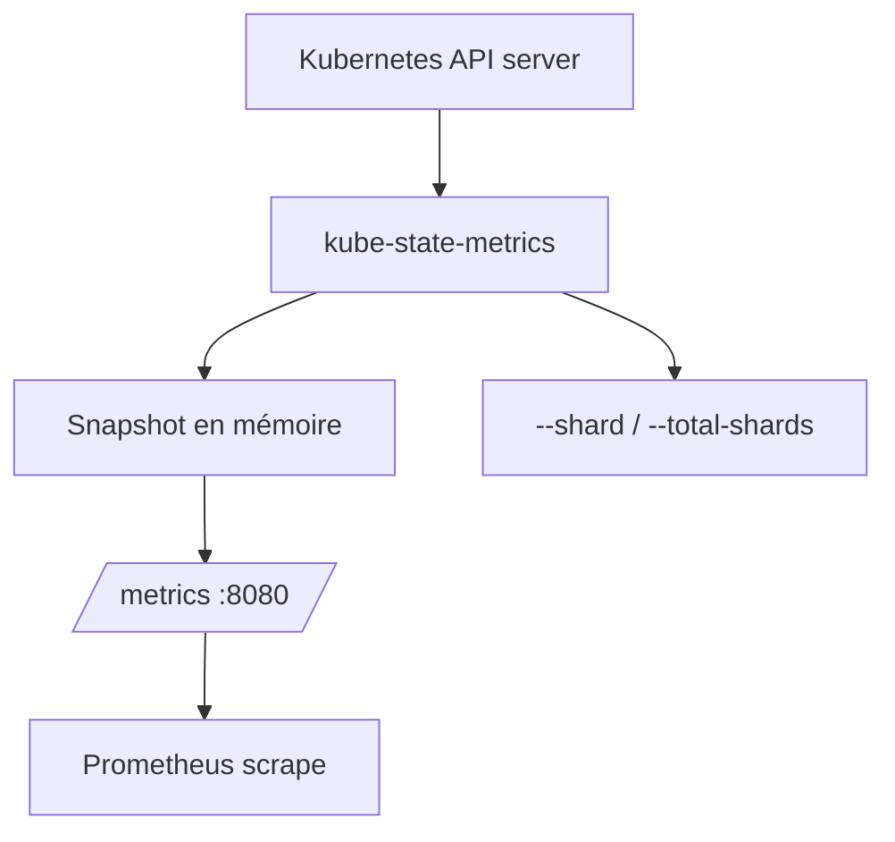

# kubernetes/kube-state-metrics

> Service qui écoute l'API Kubernetes et génère des métriques Prometheus sur l'état des objets.

## Le problème
On veut des métriques sur l'état des objets Kubernetes (déploiements, nœuds, pods) au format Prometheus, sans que kubectl masque les données brutes par des heuristiques.

## Ce que ça fait vraiment
Écoute l'apiserver et génère des métriques sur l'état des objets, sans modification (même stabilité que l'API elle-même). Exposées en texte sur `/metrics` (port 8080), consommables par Prometheus. Reflètent l'état courant : les objets supprimés disparaissent. Sharding horizontal (par md5 de l'UID), automatique (StatefulSet) ou par Deployment, et sharding par nœud pour les métriques de pods (DaemonSet). Filtrage par type de ressource via query params.

## Comment c'est branché


## Essayer
```bash
kubectl apply -f examples/standard
```
```bash
curl 'http://localhost:8080/metrics?resources=pods,secrets'
```

## Coût et pièges
Gratuit. ~250 MiB / 0,1 cœur de base ; usage croît avec la taille du cluster. Peut ingérer beaucoup de données (coûts cloud) sur les événements — configurer les métriques exposées. Sur GKE, droits RBAC à ajuster.

## Ce que ce n'est pas
Pas metrics-server : ne sert pas l'autoscaling ni les métriques de ressources CPU/mémoire live, mais l'état des objets. N'exporte lui-même vers aucune destination.

## Alternatives
- kubernetes-sigs/metrics-server : métriques de ressources pour l'autoscaling (complémentaire).
- prometheus-operator/kube-prometheus : l'installe déjà comme composant.

## Pour toi
Brique de monitoring K8s standard ; utile si tu observes des charges ML sur Kubernetes via Prometheus.
