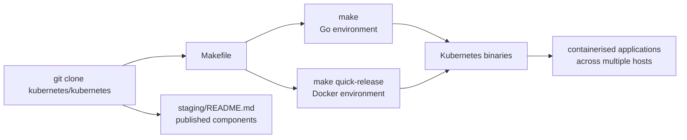

# kubernetes/kubernetes

> **The source repository of the container orchestrator, for whoever wants to build it or contribute.**

## The problem

Running containerised applications across several machines means deciding by hand where each
container goes, how it restarts when a host dies, how it is updated without downtime and how it
scales up or down. The README frames exactly that scope: deployment, maintenance and scaling of
containerised applications across multiple hosts.

## What it actually does

This repository holds the Kubernetes code itself, not a ready-to-install distribution. The README
says little about how it works and much about where to go next:

- It describes Kubernetes as an open source system providing basic mechanisms for deployment,
  maintenance and scaling of containerised applications.
- It claims a lineage with Borg, Google's internal system, and a decade and a half of running
  production workloads at scale.
- It sends usage to `kubernetes.io` and development to the `kubernetes/community` repository:
  no technical notion (pod, service, controller, scheduler) is defined here.
- It states one point that matters to a developer: published components are listed in
  `staging/README.md`, but using the `k8s.io/kubernetes` module or its packages **as a library is
  not supported**.
- It documents two build paths from source, one with a Go environment, one with a Docker
  environment.

The README is short given the size of the project: the real content is delegated to other
repositories and to the documentation site. That is the reason for the "insufficient material" flag.

## How it is wired

No code-derived diagram is provided for this repository. The graph below is rebuilt from the
README alone, which does not describe the internal architecture but only the two build chains and
the resources it points to. Internal file names are therefore unknown at this stage: only
`Makefile` and `staging/README.md` are mentioned or implied by the README commands.



Reading: the repository is cloned, then `make` produces the binaries either through a local Go
chain or through a Docker chain. Those binaries are what then manages containerised applications
across hosts. In parallel, `staging/README.md` lists the published components other projects
consume — but not through the `k8s.io/kubernetes` module itself.

## Trying it

Both blocks below are copied verbatim from the README.

```bash
git clone https://github.com/kubernetes/kubernetes
cd kubernetes
make
```

```bash
git clone https://github.com/kubernetes/kubernetes
cd kubernetes
make quick-release
```

The README documents no cluster installation command and no `kubectl` at all: for usage it points
to `kubernetes.io` and to the free "Scalable Microservices with Kubernetes" course.

## Cost and traps

The code is free and hosted by the CNCF, under a declared Apache-2.0 licence. The cost is not
there: it is in what it takes to use it. Building requires a working Go environment or a working
Docker environment, both deferred to their own documentation. Running the result assumes multiple
hosts, so machines to provide and pay for elsewhere. Explicit trap from the README: consuming
`k8s.io/kubernetes` or `k8s.io/kubernetes/...` as a library is not supported — you must go through
the published components listed in `staging/README.md`. The README gives no figure for RAM, build
time or minimum cluster size.

## What it is not

It is not an installable distribution nor a turnkey product: the README gives no cluster
installation command, only build commands. It is not a Go library you import either — the README
says so plainly. Finally it is not the Kubernetes documentation: that lives on `kubernetes.io`,
while development, governance and roadmap live in three other repositories (`community`,
`steering`, `enhancements`). Reading this README alone teaches almost nothing about how the system
actually works.

## Alternatives

No competing project is named in the README, which compares itself to nothing. Among the supplied
neighbours, none replaces this repository, but two cover adjacent needs:

- **kubernetes/minikube** — to get a local cluster without building this repository; the path to
  take if the goal is to use Kubernetes rather than build it.
- **kubernetes/kops** — to provision and manage clusters rather than produce binaries.
- **etcd-io/etcd** — a distributed storage building block, complementary and not a substitute;
  this README makes no link to it.

## For you

For a data / AI / MLOps profile, Kubernetes is the ground most model training and serving
platforms run on: knowing it is not optional. But `kubernetes.io` and a managed cluster are what
to open first; this repository only serves to build or to contribute.
