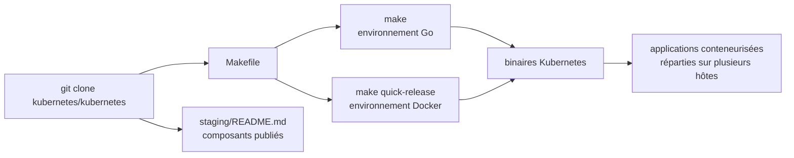

# kubernetes/kubernetes

> **Le dépôt source de l'orchestrateur de conteneurs, pour qui veut le compiler ou y contribuer.**

## Le problème

Faire tourner des applications en conteneurs sur plusieurs machines suppose de décider soi-même
où placer chaque conteneur, comment le redémarrer quand l'hôte tombe, comment le mettre à jour
sans coupure et comment monter ou descendre en charge. Le README pose exactement ce périmètre :
déploiement, maintenance et mise à l'échelle d'applications conteneurisées « across multiple hosts ».

## Ce que ça fait vraiment

Ce dépôt est le code de Kubernetes lui-même, pas une distribution prête à installer. Le README
en dit peu sur le fonctionnement et beaucoup sur les chemins d'entrée :

- Il décrit Kubernetes comme un système open source fournissant « basic mechanisms » de
  déploiement, de maintenance et de mise à l'échelle d'applications conteneurisées.
- Il revendique une filiation avec Borg, le système interne de Google, et quinze ans
  d'exploitation de charges de production à grande échelle.
- Il renvoie l'usage vers `kubernetes.io` et le développement vers le dépôt `kubernetes/community` :
  aucune notion technique (pod, service, contrôleur, planificateur) n'est définie ici.
- Il expose un point important pour un développeur : les composants publiés sont listés dans
  `staging/README.md`, mais l'usage du module `k8s.io/kubernetes` ou de ses paquets
  **comme bibliothèque n'est pas supporté**.
- Il documente deux chemins de construction depuis les sources, l'un avec un environnement Go,
  l'autre avec un environnement Docker.

Le README est court au regard de la taille du projet : tout le contenu réel est délégué à
d'autres dépôts et au site de documentation. C'est la raison de l'alerte « matière insuffisante ».

## Comment c'est branché

Aucun diagramme tiré du code n'est fourni pour ce dépôt. Le schéma ci-dessous est reconstruit
depuis le seul README, qui ne décrit pas l'architecture interne mais seulement les deux chaînes
de construction et les ressources vers lesquelles il renvoie. Les noms de fichiers internes du
projet ne sont donc pas connus à ce stade : seuls `Makefile` et `staging/README.md` sont
mentionnés ou impliqués par les commandes du README.



Lecture : le dépôt se clone, puis `make` produit les binaires soit via une chaîne Go locale,
soit via une chaîne Docker. Les binaires obtenus sont ce qui gère ensuite les applications
conteneurisées sur les hôtes. En parallèle, `staging/README.md` liste les composants publiés
que d'autres projets consomment — mais pas via le module `k8s.io/kubernetes` lui-même.

## Essayer

Les deux blocs ci-dessous sont recopiés tels quels du README.

```bash
git clone https://github.com/kubernetes/kubernetes
cd kubernetes
make
```

```bash
git clone https://github.com/kubernetes/kubernetes
cd kubernetes
make quick-release
```

Le README ne documente aucune commande d'installation d'un cluster ni aucun `kubectl` :
pour l'usage, il renvoie à `kubernetes.io` et au cours gratuit « Scalable Microservices with
Kubernetes ».

## Coût et pièges

Le code est gratuit et hébergé par la CNCF, sous licence déclarée Apache-2.0. Le coût n'est pas
là : il est dans ce qu'il faut pour s'en servir. Compiler exige un environnement Go fonctionnel
ou un environnement Docker fonctionnel, tous deux renvoyés à leur documentation propre. Faire
tourner le résultat suppose « multiple hosts », donc des machines à fournir et à payer ailleurs.
Piège explicite du README : consommer `k8s.io/kubernetes` ou `k8s.io/kubernetes/...` comme
bibliothèque n'est pas supporté — il faut passer par les composants publiés listés dans
`staging/README.md`. Le README ne chiffre ni RAM, ni durée de compilation, ni taille de cluster
minimale.

## Ce que ce n'est pas

Ce n'est pas une distribution installable ni un produit clé en main : le README ne donne aucune
commande d'installation d'un cluster, seulement des commandes de compilation. Ce n'est pas non
plus une bibliothèque Go que l'on importe — le README le dit noir sur blanc. Enfin ce n'est pas
la documentation de Kubernetes : celle-ci vit sur `kubernetes.io`, et le développement, la
gouvernance et la feuille de route vivent dans trois autres dépôts (`community`, `steering`,
`enhancements`). Lire ce README seul n'apprend presque rien du fonctionnement réel.

## Alternatives

Aucun projet concurrent n'est nommé dans le README, qui ne se compare à rien. Parmi les voisins
fournis, aucun ne remplace ce dépôt, mais deux en couvrent des usages voisins :

- **kubernetes/minikube** — pour obtenir un cluster local sans compiler ce dépôt ; c'est le
  chemin à prendre si l'objectif est d'utiliser Kubernetes, pas de le construire.
- **kubernetes/kops** — pour provisionner et gérer des clusters plutôt que produire des binaires.
- **etcd-io/etcd** — brique de stockage distribué, complémentaire et non substituable ;
  aucun lien n'en est fait dans ce README.

## Pour toi

Pour un profil data / IA / MLOps, Kubernetes est le socle sur lequel tournent la plupart des
plateformes d'entraînement et de service de modèles : le connaître n'est pas optionnel. Mais
c'est `kubernetes.io` et un cluster managé qu'il faut ouvrir en premier ; ce dépôt-ci ne sert
qu'à compiler ou à contribuer.
