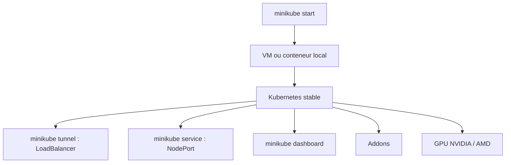

# kubernetes/minikube

> Cluster Kubernetes local sur macOS, Linux et Windows, pour développer et tester des applications.

## Le problème
Développer une application Kubernetes sans cluster oblige à déployer sur un environnement partagé à chaque essai.
Tester un LoadBalancer, un PersistentVolume ou un GPU en local n'a rien d'évident.

## Ce que ça fait vraiment
Fait tourner la dernière version stable de Kubernetes en local, avec LoadBalancer via `minikube tunnel`, multi-cluster via `minikube start -p`, NodePorts via `minikube service`, volumes persistants et tableau de bord via `minikube dashboard`.
Runtime de conteneurs sélectionnable (`minikube start --container-runtime`) et options apiserver/kubelet passables en arguments de ligne de commande.
Addons : une place de marché où les développeurs partagent des configurations de services à faire tourner sur minikube.
Support GPU NVIDIA et AMD pour l'apprentissage automatique, montages de système de fichiers, et compatibilité avec les environnements de CI courants.

## Comment c'est branché

## Essayer
Le README ne contient aucun bloc de commandes : il renvoie vers le « Getting Started Guide », un GitHub Codespace et les Dev Containers. Les commandes citées dans son texte (`minikube start`, `minikube dashboard`) ne sont pas présentées comme une procédure d'installation.

## Coût et pièges
Gratuit. La ressource consommée est locale : CPU, RAM et disque de votre poste.
Le README est très court et délègue tout à la documentation externe et au site officiel.

## Ce que ce n'est pas
Ce n'est pas un cluster de production : l'objectif annoncé est le développement local d'applications Kubernetes.
Ce n'est pas une distribution légère à la k3s : minikube fait tourner Kubernetes tel quel dans une VM ou un conteneur.
Ce n'est pas un environnement multi-nœud réaliste par défaut.

## Alternatives
Aucune alternative n'est nommée dans le README.

## Pour toi
Le choix par défaut pour tester un manifeste ou un opérateur avant de le pousser ; k3s si tu veux plus léger.
