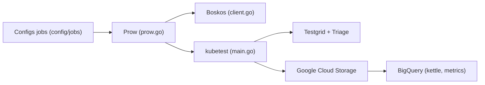

# kubernetes/test-infra

> Outils et configurations CI du projet Kubernetes : Prow, Testgrid, Boskos, kubetest et dashboards.

## Le problème
Un projet de la taille de Kubernetes doit exécuter ses tests, gérer ses ressources de test et fusionner des PR automatiquement.

## Ce que ça fait vraiment
C'est un ensemble d'outils plus que d'un service. Prow (prow.k8s.io) pilote la CI à partir de configurations de jobs dans `config/jobs`, déployées après revue de PR. Boskos prête des projets GCP, kubetest2 crée des clusters de test, Testgrid et Triage présentent résultats et échecs, Deck et Tide montrent jobs et fusions, gcsweb affiche les artefacts, kettle charge BigQuery, ghproxy met GitHub en cache, label_sync gère les labels.

## Comment c'est branché


## Essayer
```bash
# Aucune commande dans le README : il renvoie à la documentation pour
# ajouter, tester localement ou supprimer des configurations de jobs.
```

## Coût et pièges
Gratuit, mais conçu pour l'infrastructure Kubernetes (GCP, GCS, BigQuery, GitHub) ; difficile à réutiliser hors contexte. Le diagramme d'architecture du README est signalé comme à mettre à jour.

## Ce que ce n'est pas
Pas une CI clé en main pour ton projet ; ce sont les outils internes d'un projet précis. Les composants Prow sont documentés ailleurs.

## Alternatives
Non documenté dans le README : aucune alternative nommée.

## Pour toi
À ignorer, sauf si tu contribues à Kubernetes : tu y trouveras des idées de CI à grande échelle, mais rien à adopter pour un projet data ou IA courant.

