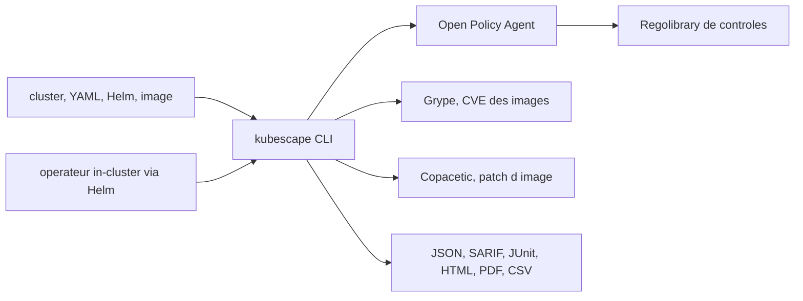

# kubescape/kubescape

> **A command-line Kubernetes security scanner, for whoever ships manifests and container images.**

## The problem

Without it you apply Kubernetes manifests with no idea whether they breach NSA-CISA, MITRE ATT&CK or the CIS Benchmarks, and you find out about image CVEs once they are running. Posture checks, image scanning and remediation usually live in three separate tools, each with its own output format.

## What it actually does

Kubescape scans a live cluster, a directory of YAML, a Helm chart, a Kustomize directory or a Git repository URL, and grades the result against frameworks of controls. It also scans container images for CVEs, and it can repair: `kubescape fix` rewrites misconfigured manifests, `kubescape patch` rebuilds a fixed image. Output comes as JSON, JUnit XML, SARIF, HTML, PDF and CSV, which plugs it straight into CI or GitHub Code Scanning. A compliance or severity threshold makes the binary exit with code 1. A `mcpserver` subcommand exposes scan data to an AI assistant. Much of this is delegated work: the README names OPA for policy evaluation, Grype for vulnerabilities, Copacetic for patching, Inspektor Gadget for eBPF runtime analysis.

## How it is wired



Per the README there are two modes: the standalone CLI, scanning on demand and calling OPA with the Regolibrary for misconfigurations, Grype for CVEs and Copacetic for patching; and an in-cluster operator installed with Helm, which repeats those scans continuously and adds eBPF runtime analysis plus network policy generation. No file names are documented in the README — only the components.

## Trying it

```sh
curl -s https://raw.githubusercontent.com/kubescape/kubescape/master/install.sh | /bin/bash
```

```bash
# Scan the current cluster
kubescape scan

# Scan a directory of manifests
kubescape scan /path/to/manifests/

# Scan an image
kubescape scan image nginx:latest

# SARIF output for GitHub Code Scanning
kubescape scan --format sarif --output results.sarif

# Fix manifests from a JSON scan
kubescape scan /path/to/manifests --format json --output results.json
kubescape fix results.json --dry-run
```

Package managers: `brew install kubescape`, `kubectl krew install kubescape`, `choco install kubescape`, `nix-shell -p kubescape`.

## Cost and traps

The tool is free and Apache 2.0. The traps are operational: `kubescape patch` needs a running `buildkitd` as root (`sudo buildkitd &`) and itself runs under `sudo`. Image scanning downloads the Grype database, so it assumes network access — the air-gapped path goes through `kubescape download artifacts` and an offline Grype-DB server run in Docker. The `kubescape config set accountID` command hints at a tie to an account with the vendor ARMO; the README does not document what that account entails or whether it gates features. Finally the operator mode, i.e. continuous monitoring, consumes in-cluster resources that the README never quantifies.

## What it is not

It is not a home-grown analysis engine: rules are evaluated by OPA, CVEs by Grype, patching by Copacetic, runtime by Inspektor Gadget. Nor is it an admission controller itself — it generates Validating Admission Policies that Kubernetes enforces. `kubescape fix` on a cluster scan applies nothing: it prints the patched manifests and leaves `kubectl apply` to you. And it is not a general-purpose scanner: outside Kubernetes and container images it has nothing to say.

## Alternatives

- **bridgecrewio/checkov**: if the need is broad static IaC scanning (Terraform, CloudFormation, Kubernetes) rather than the posture of a live cluster.
- **anchore/grype**: named by the README as Kubescape's CVE engine; take it alone if you only want image vulnerability scanning without the Kubernetes layer.
- The other catalogue neighbours (infobyte/faraday, Ullaakut/cameradar) are not comparable: they belong to pentesting, not Kubernetes posture.

## For you

If you run MLOps workloads on Kubernetes, this is the missing gate between the Helm chart and the cluster: a `kubescape scan --format sarif` in CI is cheap and catches CVE-ridden images and over-permissive manifests. A CNCF incubating project with public governance and an Apache 2.0 licence — adoption risk is low. The MCP server is a bonus if you already query your infrastructure from an assistant.
