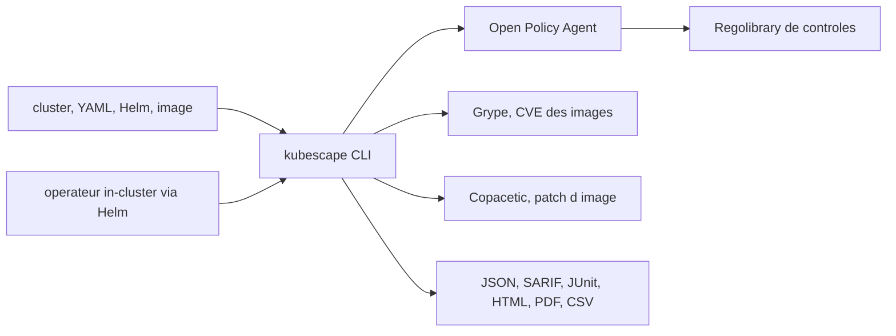

# kubescape/kubescape

> **Scanner de sécurité Kubernetes en ligne de commande, pour qui déploie des manifestes et des images.**

## Le problème

Sans lui, on déploie des manifestes Kubernetes sans savoir s'ils violent NSA-CISA, MITRE ATT&CK ou les CIS Benchmarks, et on découvre les CVE des images une fois en production. Les contrôles de posture, le scan d'images et la remédiation vivent d'ordinaire dans trois outils séparés, chacun avec son format de sortie.

## Ce que ça fait vraiment

Kubescape scanne un cluster en cours d'exécution, un dossier de YAML, un chart Helm, un répertoire Kustomize ou une URL de dépôt Git, et évalue le résultat contre des frameworks de contrôles. Il scanne aussi les images de conteneurs pour y trouver des CVE, et sait corriger : `kubescape fix` réécrit les manifestes mal configurés, `kubescape patch` reconstruit une image corrigée. Il exporte en JSON, JUnit XML, SARIF, HTML, PDF et CSV, ce qui le branche directement sur une CI ou sur GitHub Code Scanning. Un seuil de conformité ou de sévérité fait sortir le binaire en code 1. Un sous-commande `mcpserver` expose les données de scan à un assistant IA. Beaucoup de ces capacités sont en fait déléguées : le README nomme OPA pour l'évaluation des politiques, Grype pour les vulnérabilités, Copacetic pour le patch, Inspektor Gadget pour le runtime eBPF.

## Comment c'est branché



Deux modes coexistent d'après le README : le CLI autonome, qui scanne à la demande et appelle OPA avec la Regolibrary pour les mauvaises configurations, Grype pour les CVE et Copacetic pour le patch ; et un opérateur déployé dans le cluster par Helm, qui refait ces scans en continu, ajoute l'analyse runtime eBPF et la génération de politiques réseau. Les noms de fichiers ne sont pas documentés dans le README — seuls les composants le sont.

## Essayer

```sh
curl -s https://raw.githubusercontent.com/kubescape/kubescape/master/install.sh | /bin/bash
```

```bash
# Scan du cluster courant
kubescape scan

# Scan d'un dossier de manifestes
kubescape scan /path/to/manifests/

# Scan d'une image
kubescape scan image nginx:latest

# Sortie SARIF pour GitHub Code Scanning
kubescape scan --format sarif --output results.sarif

# Corriger les manifestes à partir d'un scan JSON
kubescape scan /path/to/manifests --format json --output results.json
kubescape fix results.json --dry-run
```

Par gestionnaire de paquets : `brew install kubescape`, `kubectl krew install kubescape`, `choco install kubescape`, `nix-shell -p kubescape`.

## Coût et pièges

L'outil est gratuit et sous Apache 2.0. Les pièges sont opérationnels : `kubescape patch` exige un `buildkitd` lancé en root (`sudo buildkitd &`) et s'exécute lui-même en `sudo`. Le scan d'images télécharge la base Grype, ce qui suppose un accès réseau — l'alternative air-gap passe par `kubescape download artifacts` et par un serveur de base Grype hors ligne lancé en Docker. La commande `kubescape config set accountID` laisse entendre un rattachement à un compte chez l'éditeur ARMO ; le README ne documente pas ce que ce compte implique ni s'il conditionne des fonctionnalités. Enfin le mode opérateur, donc le monitoring continu, consomme des ressources dans le cluster de façon non chiffrée par le README.

## Ce que ce n'est pas

Ce n'est pas un moteur d'analyse maison : l'évaluation des règles est faite par OPA, les CVE par Grype, le patch par Copacetic, le runtime par Inspektor Gadget. Ce n'est pas non plus un contrôleur d'admission en soi — il génère des Validating Admission Policies que Kubernetes applique. `kubescape fix` sur un scan de cluster n'applique rien : il imprime les manifestes corrigés, à vous de les passer à `kubectl apply`. Et ce n'est pas un scanner généraliste : hors Kubernetes et images de conteneurs, il n'a rien à dire.

## Alternatives

- **bridgecrewio/checkov** : si le besoin est le scan statique d'IaC au sens large (Terraform, CloudFormation, Kubernetes) plutôt que la posture d'un cluster vivant.
- **anchore/grype** : nommé par le README comme le moteur de CVE de Kubescape ; à prendre seul si l'on ne veut que le scan de vulnérabilités d'images, sans la couche Kubernetes.
- Les autres voisins du catalogue (infobyte/faraday, Ullaakut/cameradar) ne sont pas comparables : ils relèvent du pentest et non de la posture Kubernetes.

## Pour toi

Si vous faites tourner des charges MLOps sur Kubernetes, c'est le contrôle qui manque entre le Helm chart et le cluster : un `kubescape scan --format sarif` en CI coûte peu et attrape les images à CVE et les manifestes trop permissifs. Projet CNCF en incubation, gouvernance publique, licence Apache 2.0 — le risque d'adoption est faible. Le serveur MCP est un bonus si vous interrogez déjà votre infra depuis un assistant.
