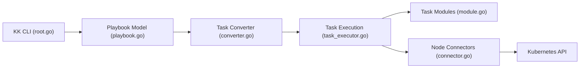

# kubesphere/kubekey

> Outil d'exécution de flux de tâches, inspiré d'Ansible, pour installer et gérer des clusters Kubernetes.

## Le problème
Installer, étendre et mettre à jour un cluster Kubernetes (en ligne ou hors ligne) demande beaucoup de scripts manuels.

## Ce que ça fait vraiment
Le binaire `kk` exécute des playbooks et rôles (projets git ou locaux) via des connecteurs locaux, SSH, Kubernetes ou Prometheus. Des playbooks livrés couvrent création/suppression de cluster, ajout/retrait de nœuds, renouvellement de certificats, export d'artefacts hors ligne. Des contrôleurs Kubernetes (Playbook, Inventory, KKCluster, KKMachine) permettent un pilotage cloud-native, et une interface web existe depuis la v4.

## Comment c'est branché


## Essayer
```bash
curl -sfL https://get-kk.kubesphere.io | sh -
./kk create cluster
./kk web --schema-path web-installer/schema --ui-path web-installer/dist
```

## Coût et pièges
Gratuit ; il faut des machines accessibles (SSH). Le README note une UI avancée « pas encore ouverte » pour une partie des fonctions.

## Ce que ce n'est pas
Pas un simple installeur : depuis la 3.x c'est un moteur de tâches générique. Pas un Kubernetes managé.

## Alternatives
Aucune alternative nommée dans le README (comparaison à Ansible pour la conception des flux).

## Pour toi
À surveiller : utile si tu montes toi-même des clusters (GPU on-prem), sinon un Kubernetes managé évite cet outillage.

