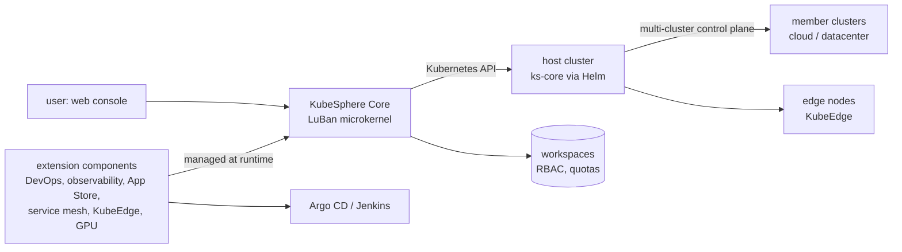

# kubesphere/kubesphere

> **A multi-tenant web console layered on an existing Kubernetes cluster, to run it without kubectl.**

## The problem

Without such a layer, everything goes through `kubectl` and YAML: each team reinvents its own
isolation, quotas, CI/CD, monitoring and application catalogue. And once there are several
clusters — datacenter, cloud, edge — there is no single place left from which to see and steer
the whole estate.

## What it actually does

KubeSphere describes itself as a "distributed operating system for cloud-native application
management" whose kernel is Kubernetes. In practice it adds to the cluster:

- a **web console** with workbench, project resources, pipelines and an app store (the
  screenshots in the README);
- **multi-tenancy**: isolated workspaces, role-based access control, fine-grained permissions
  and quota management;
- a **centralized control plane** to manage multiple Kubernetes clusters and propagate an
  application to several of them across different cloud providers;
- the **provisioning of Kubernetes itself** on any infrastructure, online or air-gapped.

In 4.x the architecture is a microkernel (codename LuBan): KubeSphere Core holds only the
basic functions needed to run, and everything else ships as **extension components** that can
be managed while the system is running. The README names them: DevOps (GitOps through Argo CD,
CI through Jenkins), observability (metrics, events, auditing logs, multi-tenant log query and
collection, alerting and notification), Istio-based service mesh, an App Store for Helm
applications, edge computing through KubeEdge, networking (Calico, Flannel, Kube-OVN, OpenELB),
storage (GlusterFS, CephRBD, NFS, LocalPV, CSI plugins), and GPU workload scheduling with
per-tenant GPU quotas.

## How it is wired



No code-derived diagram exists for this repository: the graph above only uses parts named in
the README.

## Trying it

The single command the README gives, to install on an existing Kubernetes cluster:

```bash
helm upgrade --install -n kubesphere-system --create-namespace ks-core https://charts.kubesphere.io/main/ks-core-1.1.3.tgz --debug --wait
```

Otherwise the README points to KubeSphere Lite (a free managed cluster service, creation
announced in a few seconds after registration), to one-click installs on Amazon EKS, Azure
AKS, DigitalOcean Kubernetes and QingCloud QKE, and to the air-gapped installation guide.

## Cost and traps

The code is free, but **you need a Kubernetes cluster first**: that is the real cost, and the
README gives no sizing and no resource figures, only a qualitative claim. GitHub could not identify the license and the README names none: check inside
the repository before any corporate use. Around the project sit several paid or third-party
pieces: cloud marketplaces, official ticket support, and the extensions that embed Argo CD,
Jenkins, Istio or KubeEdge — each one more component to operate and upgrade. The catalogue
labels this repository an agent skill or plugin, which is wrong: there is nothing agent-like
here.

## What it is not

- **Not managed Kubernetes, and not hosting.** Except through KubeSphere Lite or a cloud
  provider, the cluster is yours to own and operate; the required size is undocumented, and
  this is not aimed at a laptop or a toy cluster.
- **Not a thin layer.** Multi-tenancy, the console and the extensions add CRDs, controllers
  and components to watch on top of the cluster.
- **Not its own CI/CD or mesh**: most of it is integration of Argo CD, Jenkins, Istio and
  KubeEdge. You adopt those projects along with it, and their limits too.
- **Not an AI-oriented tool.** The only connection is GPU scheduling and per-tenant GPU quotas
  from the UI.

## Alternatives

No comparable alternative in the catalogue: among the suggested neighbours, `netdata/netdata`
only covers monitoring, `IBM/mcp-context-forge` and `Agenta-AI/agenta` belong to LLMOps, and
`ongridio/ongrid` is off topic. Real comparisons would be with the projects KubeSphere
integrates rather than replaces (Argo CD, Istio, KubeEdge, OpenELB), and the README names no
direct competitor.

## For you

Worth knowing if ML workloads have to run on a Kubernetes cluster shared between teams:
isolated workspaces, per-tenant GPU quotas and the Helm catalogue answer a genuine platform
need. Outside that case it is a platform to operate, far from a data science tool — one to
watch, not to install out of curiosity.
