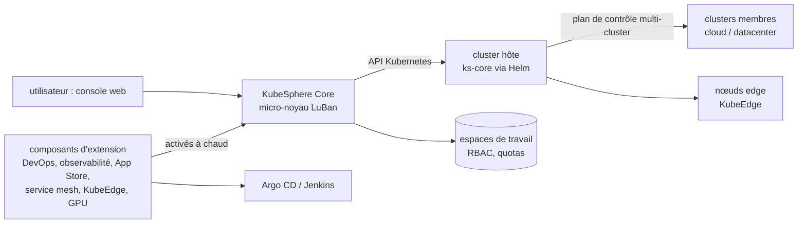

# kubesphere/kubesphere

> **Une console web multi-tenant posée sur un cluster Kubernetes existant, pour l'exploiter sans kubectl.**

## Le problème

Sans cette couche, tout passe par `kubectl` et des YAML : chaque équipe réinvente son
cloisonnement, ses quotas, son CI/CD, sa supervision et son catalogue d'applications. Et dès
qu'il y a plusieurs clusters — datacenter, cloud, edge — il n'existe plus de point unique
depuis lequel voir et piloter l'ensemble.

## Ce que ça fait vraiment

KubeSphere se décrit comme un « système d'exploitation distribué » dont le noyau est
Kubernetes. Concrètement, il ajoute au cluster :

- une **console web** avec workbench, ressources de projet, pipelines et magasin
  d'applications (les captures du README) ;
- un **multi-tenant** : espaces de travail isolés, contrôle d'accès par rôle, permissions
  fines et quotas ;
- un **plan de contrôle centralisé** pour gérer plusieurs clusters Kubernetes et propager une
  application vers plusieurs d'entre eux, chez différents fournisseurs ;
- l'**installation de Kubernetes** lui-même sur n'importe quelle infrastructure, en ligne ou
  en environnement déconnecté (air-gapped).

En 4.x, l'architecture est un micro-noyau (nom de code LuBan) : le cœur, KubeSphere Core, ne
contient que les fonctions de base, et le reste arrive en **composants d'extension**
activables et désactivables pendant que le système tourne. Le README les nomme : DevOps
(GitOps via Argo CD, CI via Jenkins), observabilité (métriques, événements, journaux
multi-tenant, alertes), service mesh appuyé sur Istio, App Store d'applications Helm,
edge via KubeEdge, réseau (Calico, Flannel, Kube-OVN, OpenELB), stockage (GlusterFS, CephRBD,
NFS, LocalPV, plugins CSI) et ordonnancement/quotas de GPU par tenant.

## Comment c'est branché



Aucun diagramme tiré du code n'existe pour ce dépôt : ce schéma ne reprend que les pièces
nommées dans le README.

## Essayer

La seule commande donnée par le README, pour installer sur un cluster Kubernetes existant :

```bash
helm upgrade --install -n kubesphere-system --create-namespace ks-core https://charts.kubesphere.io/main/ks-core-1.1.3.tgz --debug --wait
```

Le README renvoie sinon vers KubeSphere Lite (cluster managé gratuit, création annoncée en
quelques secondes après inscription), vers des installations en un clic sur EKS, AKS,
DigitalOcean Kubernetes et QingCloud QKE, et vers la procédure air-gapped.

## Coût et pièges

Le code est gratuit, mais **il faut déjà un cluster Kubernetes** : c'est le vrai coût, et le
README ne donne ni dimensionnement ni chiffre de consommation, seulement une affirmation
qualitative. La licence n'est pas identifiée par GitHub et le
README n'en nomme aucune : à vérifier dans le dépôt avant tout usage en entreprise. Autour du
projet, plusieurs briques payantes ou tierces : places de marché cloud, support par tickets
officiel, et les extensions qui embarquent Argo CD, Jenkins, Istio ou KubeEdge — donc autant
de composants à exploiter et mettre à jour. Le catalogue classe ce dépôt comme « skill /
plugin d'agent » : c'est faux, il n'y a là rien d'un agent.

## Ce que ce n'est pas

- **Pas un Kubernetes managé, ni un hébergement.** Sauf via KubeSphere Lite ou un fournisseur
  cloud, c'est à toi d'avoir et d'exploiter le cluster ; la taille nécessaire n'est pas
  documentée, et ce n'est pas une cible pour un poste de développement ou un cluster jouet.
- **Pas une couche fine.** Le multi-tenant, la console et les extensions ajoutent des CRD, des
  contrôleurs et des composants à surveiller par-dessus le cluster.
- **Pas un CI/CD ni un mesh maison** : l'essentiel est de l'intégration d'Argo CD, Jenkins,
  Istio, KubeEdge. On adopte ces projets avec, et leurs limites avec eux.
- **Pas un outil orienté IA.** Le seul lien est l'ordonnancement et les quotas de GPU par
  tenant, depuis l'interface.

## Alternatives

Aucune alternative comparable dans le catalogue : parmi les voisins proposés, `netdata/netdata`
ne couvre que la supervision, `IBM/mcp-context-forge` et `Agenta-AI/agenta` relèvent du
LLMOps, et `ongridio/ongrid` est hors sujet. Les vraies comparaisons se feraient avec les
projets que KubeSphere intègre plutôt qu'il ne remplace (Argo CD, Istio, KubeEdge, OpenELB),
et le README ne nomme aucun concurrent direct.

## Pour toi

Utile si des charges ML doivent tourner sur un Kubernetes partagé entre équipes : les espaces
cloisonnés, les quotas GPU par tenant et le catalogue Helm répondent à un besoin réel de
plate-forme. Hors de ce cas, c'est une plate-forme d'exploitation à opérer, très loin d'un
outil de data science — à surveiller, pas à installer pour voir.
