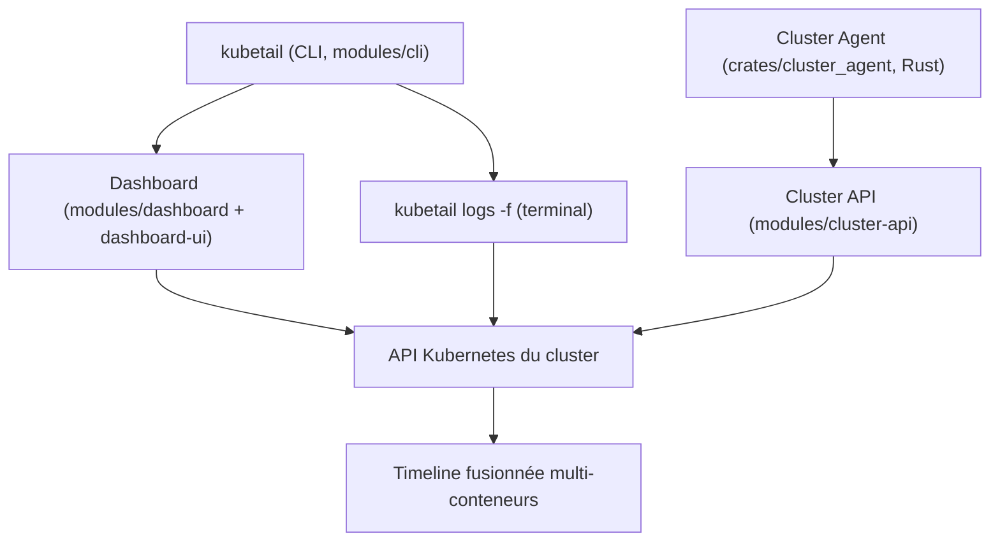

# kubetail-org/kubetail

> Tableau de bord temps réel qui fusionne les logs de tous les conteneurs d'un workload.

## Le problème
Suivre une requête qui traverse plusieurs conteneurs éphémères oblige à ouvrir autant de
`kubectl logs` et à recoller la chronologie à la main.

## Ce que ça fait vraiment
La CLI `kubetail` est le point d'entrée : elle lance un tableau de bord web local ou envoie
les logs bruts directement dans le terminal. Les messages de tous les conteneurs d'un
Deployment ou d'un DaemonSet apparaissent dans une seule timeline chronologique. Le filtrage
se fait par workload, par plage de temps absolue ou relative, par propriété de nœud (zone de
disponibilité, architecture CPU, identifiant de nœud) et par grep. Les logs sont récupérés via
l'API Kubernetes du cluster, donc rien n'est transféré à un service externe ; la même API sert
à suivre les événements de cycle de vie des conteneurs pour garder la timeline cohérente quand
un conteneur démarre, s'arrête ou est remplacé. Fonctionne sur le poste, en cluster ou en
Docker ; bascule entre plusieurs clusters en mode desktop.

## Comment c'est branché


## Essayer
```bash
brew install kubetail
curl -sS https://www.kubetail.com/install.sh | bash
kubetail serve
kubetail logs -f deployments/my-app
kubetail cluster install
kubetail config init
```

## Coût et pièges
Gratuit, et privé par défaut puisque les données ne quittent pas ton cluster. Les
fonctionnalités avancées demandent d'installer la Kubetail API **dans** le cluster
(`kubetail cluster install`), ce qui n'est plus un simple outil local. Le changement de
cluster est réservé au mode desktop. Seize méthodes d'installation sont listées (Krew, Snap,
Winget, apt, dnf, zypper, apk, AUR, Nix, asdf, Chocolatey, Scoop, MacPorts…).

## Ce que ce n'est pas
Ce n'est pas une plateforme de logs avec rétention et indexation : il lit l'API Kubernetes en
direct, il ne stocke pas. Ce n'est donc pas un remplaçant de Loki ou d'Elastic pour de
l'historique long. Pas d'alerting décrit.

## Alternatives
- Aucune alternative nommée dans le README.

## Pour toi
Le confort immédiat quand tu débogues un job d'entraînement réparti sur plusieurs pods.
