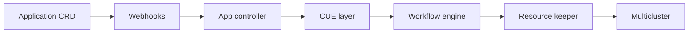

# kubevela/kubevela

> Plan de contrôle Kubernetes pour livrer des applications multi-clusters via le modèle OAM.

## Le problème
Déployer sur plusieurs clusters et clouds avec canary et rollback finit en scripts de colle fragiles.

## Ce que ça fait vraiment
Des CRD (`Application`, `ComponentDefinition`, `TraitDefinition`…) réconciliées par un contrôleur.
Le rendu passe par CUE en manifests concrets, puis `resourcekeeper` les applique et suit les ressources créées.
Des workflows de déploiement avec étapes Helm, Terraform et multi-cluster.
Des addons pour étendre la plateforme ; webhooks d'admission ; CLI `vela`.

## Comment c'est branché

## Essayer
Aucune commande documentée dans le README (renvoi vers la doc d'installation).

## Coût et pièges
Il faut un cluster Kubernetes. Il est annoncé léger (un pod, 0,5 CPU / 1 Go).

## Ce que ce n'est pas
Pas un outil CI : il se branche sur un CI/CD ou GitOps existant.

## Alternatives
Aucune alternative nommée dans le README.

## Pour toi
À ignorer, sauf si tu opères toi-même une plateforme Kubernetes multi-clusters : c'est de l'outillage plateforme, trop loin du quotidien MLOps.
