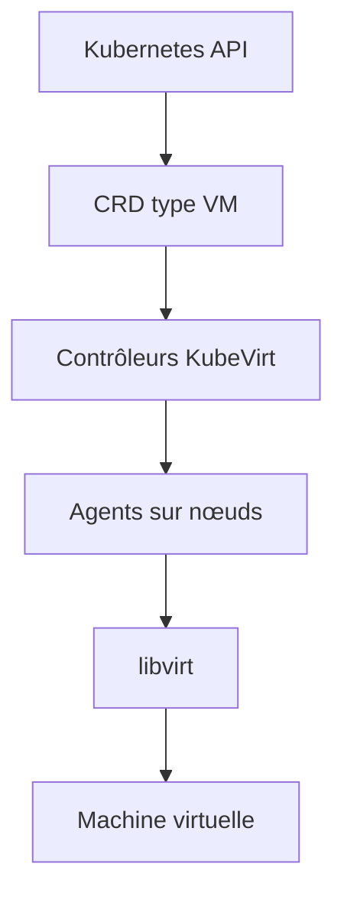

# kubevirt/kubevirt

> Add-on Kubernetes pour gérer des machines virtuelles comme des ressources natives du cluster.

## Le problème
Faire cohabiter VM et conteneurs sous une même API demande d'habitude deux plans de gestion séparés. Migrer des charges VM vers Kubernetes n'a pas de terrain commun.

## Ce que ça fait vraiment
Étend Kubernetes via des CRD (type `VM`) pour gérer les VM aux côtés des autres ressources. Ajoute contrôleurs et agents qui apportent la logique métier : créer, planifier, lancer, arrêter, supprimer une VM déclarativement. S'appuie sur libvirt.

## Comment c'est branché

## Essayer
Aucune commande d'installation présente dans le README (renvoie vers le quickstart de kubevirt.io). L'écrire : documentation à consulter sur kubevirt.io/docs.

## Coût et pièges
Gratuit. Nécessite un cluster Kubernetes fonctionnel et des nœuds compatibles virtualisation. Contributions soumises au Developer Certificate of Origin (`git commit -s`).

## Ce que ce n'est pas
Pas un hyperviseur autonome : c'est une extension de Kubernetes, sans cluster il n'y a rien.

## Alternatives
- Libvirt : la couche sous-jacente, sans l'intégration Kubernetes.
- Cockpit : interface de gestion mentionnée comme ressource liée.

## Pour toi
Hors périmètre data/IA sauf si tu dois faire tourner des VM legacy à côté de tes charges ML sur Kubernetes.
