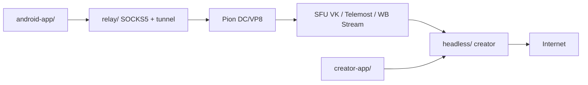

# kulikov0/whitelist-bypass

> Fait passer du trafic internet dans des appels vidéo (VK, Telemost, WB Stream) pour contourner une censure par liste blanche.

## Le problème
Là où seuls des services autorisés sont joignables, l'accès au reste d'internet est coupé ; l'outil vise à rétablir un canal en s'appuyant sur des plateformes d'appel vidéo autorisées.

## Ce que ça fait vraiment
- Deux rôles : un « creator » (sur internet libre) qui ouvre l'appel, et un « joiner » (réseau restreint) qui le rejoint et expose un proxy SOCKS5 ou un VPN Android.
- Le trafic TCP/UDP est transporté soit par DataChannel, soit encodé dans une piste vidéo VP8 ; obfuscation ChaCha20 en option (mode headless).
- Voie recommandée : binaires Go (Pion) sans navigateur ; ancienne voie Electron/WebView en fin de vie.
- Clients Android, iOS (proxy SOCKS5 seul) et Linux.

## Comment c'est branché


## Essayer
```bash
./build-headless.sh
./headless/telemost-joiner/headless-telemost-joiner --tm-link <link> --socks-port 1080
```

## Coût et pièges
Gratuit, mais dépend de comptes et de services tiers russes dont les API peuvent changer ; le côté creator exige des cookies exportés d'un compte connecté. Usage à évaluer selon le droit local et les conditions d'utilisation des plateformes ; risque de blocage du compte.

## Ce que ce n'est pas
Pas un VPN commercial ni une garantie d'anonymat : rien dans le README n'en établit. Documentation d'installation principalement en russe (docs/SETUP.md).

## Alternatives
Aucune alternative nommée dans le README.

## Pour toi
Ignorer : outil de contournement de réseau sans usage data/IA/MLOps, fragile car adossé à des API de plateformes tierces et porté par une seule personne.

