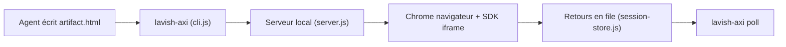

# kunchenguid/lavish-axi

> CLI qui ouvre les artefacts HTML d'un agent dans un navigateur local pour les annoter et renvoyer du retour.

## Le problème
Relire un document HTML produit par un agent se réduit à des captures d'écran et de longues réponses du type « voici ce qu'il faut changer ».

## Ce que ça fait vraiment
`lavish-axi <fichier>` lance un serveur local et affiche l'artefact dans une iframe isolée ; l'utilisateur annote éléments ou texte, édite des diagrammes Mermaid en tableaux blancs, envoie des messages. `lavish-axi poll` attend et remet ces retours à l'agent. Export HTML autonome, partage optionnel vers ht-ml.app (tiers), crochets de session.

## Comment c'est branché


## Essayer
```bash
npx skills add kunchenguid/lavish-axi --skill lavish
npx -y lavish-axi --help
npm install -g lavish-axi
lavish-axi setup hooks
```

## Coût et pièges
Gratuit. Le partage envoie l'artefact à ht-ml.app, public par défaut ; sans suppression possible. Un module de télémétrie existe (`telemetry.js`), à examiner. Écoute réseau : avec Tailscale, le serveur non authentifié devient joignable sur le tailnet.

## Ce que ce n'est pas
Pas un éditeur de documents ni un service cloud : boucle locale de relecture d'artefacts. Dépôt récent (mai 2026), fonctionnalités nombreuses et en évolution.

## Alternatives
- Aucune alternative citée dans le README.

## Pour toi
À surveiller : pertinent si tu fais travailler des agents sur des livrables visuels ; vérifier télémétrie et partage avant usage sur des données sensibles.

