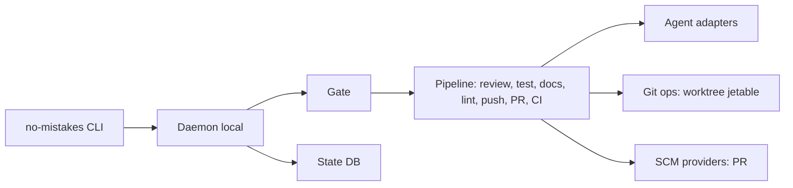

# kunchenguid/no-mistakes

> Proxy git local qui valide une branche par un pipeline d'agents IA avant d'ouvrir une pull request propre.

## Le problème
Des branches écrites vite, souvent par un agent de code, arrivent en revue avec bugs, tests manquants et PR mal rédigées.

## Ce que ça fait vraiment
On pousse vers le remote `no-mistakes` plutôt que `origin`. Il crée un worktree jetable et enchaîne revue, test, docs, lint, push, PR puis suivi de la CI, avec corrections automatiques des cas sûrs et escalade des autres à l'humain. Il fonctionne avec plusieurs agents (claude, codex, opencode, cursor, etc.) et fournit un skill `/no-mistakes`. Un démon local, une base d'état et un TUI portent le suivi des exécutions.

## Comment c'est branché


## Essayer
```bash
curl -fsSL https://raw.githubusercontent.com/kunchenguid/no-mistakes/main/docs/install.sh | sh
no-mistakes init
git push no-mistakes
no-mistakes
```

## Coût et pièges
Le pipeline exige un agent configuré et consomme son quota ou sa clé d'API ; le README précise que `make e2e-record` dépense de vrais crédits. L'installation se fait par `curl | sh`. L'architecture décrite d'après le code mentionne un module de télémétrie.

## Ce que ce n'est pas
Ce n'est pas un remplaçant de la revue humaine : les changements touchant l'intention sont escalés. Il ne remplace pas non plus une CI.

## Alternatives
Aucune alternative nommée dans le README.

## Pour toi
Surveiller : utile si tu fais écrire du code par des agents, mais projet de cinq mois, tenu par une personne, avec télémétrie et coût de quota à mesurer avant adoption.

