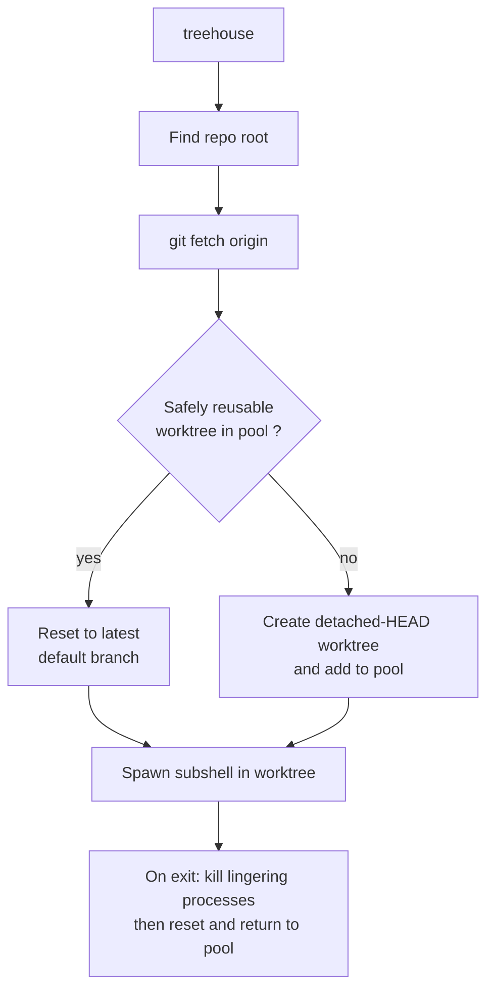

# kunchenguid/treehouse

> **A Go CLI that recycles a pool of git worktrees so several agents can work in parallel.**

## The problem

Running several agents on one repository means either juggling clones or creating a fresh
worktree per session — and every fresh worktree loses the installed dependencies and the
build cache. The README also names the collision risk: two agents stepping on each other
inside the same working tree.

## What it actually does

Treehouse keeps a **pool of git worktrees per repository**, stored under `~/.treehouse/` by
default, or inside the project with `--root .`. Running `treehouse` scans the pool for a
worktree that is safely reusable — idle, unleased, clean, and with HEAD already merged into
the exact reset target — otherwise it creates one at detached HEAD on whichever default
branch is further ahead, then spawns a subshell. On exit it terminates lingering processes,
verifies none remain, resets the worktree and returns it to the pool with dependencies
intact. Around that: durable leases (`get --lease`) that no later `get` or `prune` can take,
in-use detection by process scan, a `prune` that is a dry run unless `--yes`, gitignored-file
seeding through `.worktreeinclude`, `post_create` / `pre_destroy` hooks, and a Jujutsu
backend the README calls experimental.

## How it is wired

No code-derived diagram exists for this repository; the flow below is rebuilt from the
README's "How It Works" section.



Pool state is a small on-disk file written under a lock by each command, with no daemon; it
is replaced atomically through a temp file, and rebuilt then quarantined if it is empty or
truncated. Configuration is read from repo-level `treehouse.toml` and user-level
`~/.config/treehouse/config.toml` — hooks in the repo-level file are deliberately ignored.

## Try it

```sh
curl -fsSL https://kunchenguid.github.io/treehouse/install.sh | sh
```

```sh
$ cd myproject
$ treehouse
$ exit
```

Other install routes given by the README: `go install github.com/kunchenguid/treehouse@latest`,
`nix run github:kunchenguid/treehouse`, or `make install` from source.

## Cost and traps

Free, MIT, one binary. The installer arrives via `curl | sh` from a GitHub Pages URL, worth
reading before running. The pool costs one worktree per slot on disk, 16 by default. The jj
backend is announced as experimental and rejects an explicit base. Worktrees stay at detached
HEAD, so this is not branch management. A failing hook does not fail the operation, it is
only logged. A `--lease` holds a worktree until an explicit `treehouse return`, so a
forgotten lease ties up a slot.

## What it is not

Not an agent orchestrator or runtime: treehouse gives the isolated environment, not the
agent. Not a branch manager — there is no `-b`, nothing is created or checked out. Not a
service: no daemon, no server, everything is an inline CLI command. And not a security
sandbox: isolation covers the working tree, not processes the way a container would.

## Alternatives

The README names no competing tool; it only mentions [jj-vcs/jj](https://github.com/jj-vcs/jj),
which is a selectable backend rather than a replacement. No comparable alternative in the
catalogue: the suggested neighbours (docker/docker-agent, j3ssie/osmedeus,
GH05TCREW/pentestagent, renatoasse/opensquad) address other subjects. The real comparison
point stays hand-rolled `git worktree`.

## For you

If you run several agent sessions against one repository, this is the missing link: each
agent gets a clean worktree without losing `node_modules`, `.venv` or the build cache. The
`--root .` mode keeps the pool inside the project and disappears with it, and
`get --lease --json` scripts cleanly. Try it first on a repository that does not matter: it
is carried by a single person and it really does manipulate git worktrees.
