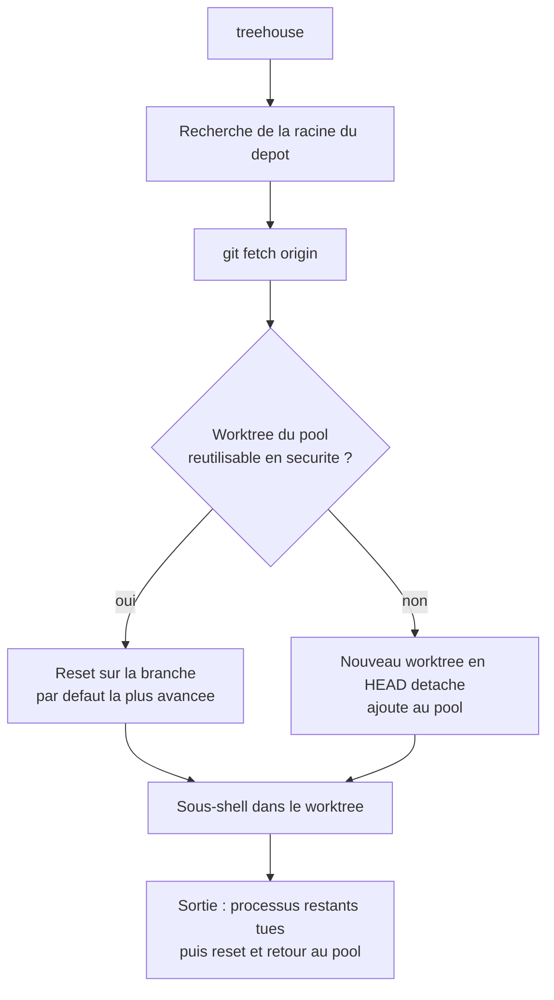

# kunchenguid/treehouse

> **CLI Go qui recycle un pool de worktrees git pour faire tourner plusieurs agents en parallèle.**

## Le problème

Faire travailler plusieurs agents sur le même dépôt oblige soit à jongler entre des clones,
soit à créer un worktree par session — et à chaque fois les dépendances installées et le cache
de build repartent de zéro. Le README pose aussi le risque de collision : deux agents qui
se marchent dessus dans le même arbre de travail.

## Ce que ça fait vraiment

Treehouse tient un **pool de worktrees git par dépôt**, rangé sous `~/.treehouse/` par défaut
(ou dans le projet avec `--root .`). `treehouse` cherche un worktree réutilisable en sécurité
— inactif, sans bail, propre, et dont le HEAD est déjà fusionné dans la cible de reset — sinon
il en crée un en HEAD détaché sur la branche par défaut la plus avancée, puis ouvre un
sous-shell. À la sortie, il tue les processus restants, vérifie qu'il n'en reste aucun, remet
le worktree à zéro et le rend au pool avec ses dépendances intactes. Autour de ça : baux
durables (`get --lease`) qu'aucun `get` ni `prune` ne peut reprendre, détection d'usage par
scan de processus, `prune` en dry-run par défaut, ensemencement de fichiers gitignorés via
`.worktreeinclude`, hooks `post_create` / `pre_destroy`, et un backend Jujutsu déclaré
expérimental.

## Comment c'est branché

Aucun diagramme tiré du code n'existe pour ce dépôt ; ce schéma est reconstruit depuis la
section « How It Works » du README.



L'état du pool est un petit fichier sur disque, écrit sous verrou par chaque commande, sans
démon ; il est réécrit atomiquement via fichier temporaire et remplacement, et reconstruit
puis mis en quarantaine s'il est vide ou tronqué. La configuration se lit dans
`treehouse.toml` au niveau du dépôt et `~/.config/treehouse/config.toml` au niveau
utilisateur — les hooks du fichier de dépôt sont volontairement ignorés.

## Essayer

```sh
curl -fsSL https://kunchenguid.github.io/treehouse/install.sh | sh
```

```sh
$ cd myproject
$ treehouse
$ exit
```

Autres voies d'installation données par le README : `go install github.com/kunchenguid/treehouse@latest`,
`nix run github:kunchenguid/treehouse`, ou `make install` depuis les sources.

## Coût et pièges

Gratuit, MIT, un binaire à installer. Le script d'installation se récupère par `curl | sh`
depuis une page GitHub Pages, à lire avant de l'exécuter. Le pool consomme un worktree par
slot (16 par défaut) sur le disque. Le backend jj est annoncé expérimental et refuse une base
explicite. Les worktrees restent en HEAD détaché : ce n'est pas un outil de gestion de
branches. Un hook qui échoue ne fait pas échouer l'opération, il est seulement journalisé.
`--lease` protège un worktree jusqu'à `treehouse return` explicite, donc un bail oublié
immobilise un slot.

## Ce que ce n'est pas

Ce n'est pas un orchestrateur d'agents ni un runtime : treehouse fournit l'environnement
isolé, pas l'agent. Ce n'est pas un gestionnaire de branches (pas de `-b`, rien n'est créé ni
checkouté). Ce n'est pas un service : pas de démon, pas de serveur, tout est en ligne de
commande. Et ce n'est pas un bac à sable de sécurité : l'isolation porte sur l'arbre de
travail, pas sur les processus au sens conteneur.

## Alternatives

Le README ne cite pas d'outil concurrent ; il ne nomme que [jj-vcs/jj](https://github.com/jj-vcs/jj),
qui est un backend possible et non un remplaçant. Aucune alternative comparable dans le
catalogue : les voisins proposés (docker/docker-agent, j3ssie/osmedeus, GH05TCREW/pentestagent,
renatoasse/opensquad) traitent d'autres sujets. Le point de comparaison réel reste
`git worktree` à la main.

## Pour toi

Si tu lances plusieurs sessions d'agents sur un même dépôt, c'est exactement le chaînon
manquant : chaque agent obtient un worktree propre sans reperdre `node_modules`, `.venv` ou
le cache de build. Le mode `--root .` garde le pool dans le projet et disparaît avec lui, et
`get --lease --json` s'automatise depuis un script. À tester d'abord sur un dépôt sans enjeu :
c'est un outil porté par une seule personne, et il manipule des worktrees git pour de vrai.
