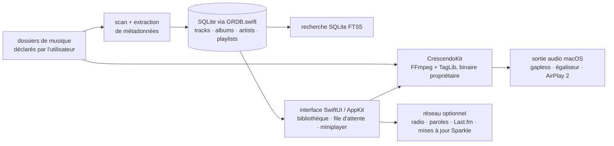

# kushalpandya/Petrichor

> **An offline music player for macOS that indexes your local folders into a SQLite database.**

## The problem

Listening to a large collection of local audio files on macOS usually means either a streaming
app that wants an account and a connection first, or a player that handles a handful of formats
and mishandles metadata.

## What it actually does

Petrichor is a native macOS application (Swift and SwiftUI, some parts in AppKit) that plays
audio files already sitting on your disk.

- You point it at folders: it scans them, extracts metadata and fills a SQLite database. The
  README states it never alters your files or folder structure.
- It imports and plays the 46 extensions listed in the README (MP3, AAC, ALAC, FLAC, Ogg, Opus,
  WAV, AIFF, APE, WavPack, DSD, WMA, DTS and more). Lossless status is read from the encoding
  in the file rather than guessed from the extension. No DRM files, no `.m4b`, no tracker
  modules, no MIDI.
- Track search runs on SQLite FTS5; regular playlists with import/export, plus smart playlists
  with conditional, negative and regular-expression rules.
- Playback side: gapless, crossfade, ReplayGain normalization, equalizer, spatial audio,
  AirPlay 2 output, miniplayer, menubar and dock controls, dark mode.
- Network extras, all disabled by default: Internet radio, synced lyrics download, artist
  images and bios, Last.fm scrobbling. No usage analytics at all.
- Shortcuts, Automation API and Siri support.

## How it is wired

No code-derived diagram exists for this repository. The graph below follows the stack the
README declares: folder scanning, SQLite through GRDB.swift, and the CrescendoKit engine.



## Trying it

The README documents two install paths. Only one is a command line:

```bash
brew install --cask petrichor
```

The other is manual: download the latest `.dmg` from Releases, drag the app icon into
Applications, then right-click **Petrichor > Open**. To build your own installer the README
points to `Scripts/build-installer.sh` (with `--bypass-notary` if you skip notarization),
requiring Xcode plus `xcpretty` and `create-dmg`.

## Cost and gotchas

Free, MIT licensed, no API key and no account needed for basic use. It requires macOS 14 or
later (Apple Silicon or Intel), so nothing runs on Linux or Windows. Last.fm scrobbling needs a
Last.fm account and stores a session key in the macOS Keychain. Producing your own notarized
installer requires a paid Apple Developer account. Watch the licence chain: the playback engine,
CrescendoKit, is **proprietary and distributed as a binary**, dynamically links FFmpeg
(LGPL-2.1-or-later) and statically embeds TagLib (MPL-1.1) — so the MIT licence does not cover
the component that actually decodes the audio.

## What it is not

It is not a streaming client: no online catalogue, no subscription, it only plays what you
already own. It is not a library manager that tidies or renames files — it reads, and only
writes when exporting M3U playlists. And it is not a reusable library: the repository ships a
macOS application, while the audio core is a closed component hosted elsewhere.

## Alternatives

No comparable alternative in the catalogue. The suggested neighbours are off topic:
altic-dev/FluidVoice and OpenWhispr/openwhispr do voice dictation, argmaxinc/argmax-oss-swift
does model inference in Swift, jaywcjlove/DevHub is a developer utility — the only thing they
share is the macOS platform, and none of them plays a local music library.

## For you

Skip it professionally: this is a consumer desktop application with no bearing on a data, AI or
MLOps pipeline. Keep it only as a clean worked example of SwiftUI plus SQLite/FTS5 over tens of
thousands of metadata rows — or as a personal player if you own a file collection and a Mac.
