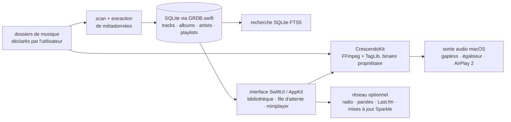

# kushalpandya/Petrichor

> **Lecteur de musique hors ligne pour macOS, qui indexe vos dossiers locaux dans une base SQLite.**

## Le problème

Sur macOS, écouter une grande collection de fichiers audio locaux suppose soit de passer par
une application de streaming qui veut d'abord un compte et une connexion, soit de composer avec
un lecteur qui ne lit qu'une poignée de formats et range mal les métadonnées.

## Ce que ça fait vraiment

Petrichor est une application macOS native (Swift, SwiftUI, quelques parties en AppKit) qui
lit des fichiers audio déjà présents sur le disque.

- On lui déclare des dossiers : elle les scanne, extrait les métadonnées et remplit une base
  SQLite. Le README précise qu'elle ne modifie jamais les fichiers ni l'arborescence.
- Elle importe et joue 46 extensions listées dans le README (MP3, AAC, ALAC, FLAC, Ogg, Opus,
  WAV, AIFF, APE, WavPack, DSD, WMA, DTS…). Le caractère lossless est lu dans le fichier, pas
  déduit de l'extension. Ni DRM, ni `.m4b`, ni modules tracker, ni MIDI.
- La recherche de morceaux passe par SQLite FTS5 ; playlists classiques, import/export, et
  playlists intelligentes à règles conditionnelles, négatives ou en expression régulière.
- Côté lecture : gapless, crossfade, normalisation ReplayGain, égaliseur, audio spatial,
  sortie AirPlay 2, miniplayer, contrôles menubar et dock, mode sombre.
- Extras réseau, tous désactivés par défaut : radio Internet, téléchargement de paroles
  synchronisées, images et biographies d'artistes, scrobbling Last.fm. Aucune analytique.
- Prise en charge des Shortcuts, de l'API d'automatisation et de Siri.

## Comment c'est branché

Aucun diagramme tiré du code n'existe pour ce dépôt. Le schéma ci-dessous reprend la pile que
le README déclare : scan de dossiers, base SQLite via GRDB.swift, moteur CrescendoKit.



## Essayer

Le README documente deux voies d'installation. En ligne de commande, une seule :

```bash
brew install --cask petrichor
```

L'autre est manuelle : télécharger le `.dmg` de la dernière release, glisser l'icône dans
Applications, puis clic droit sur **Petrichor > Open**. Pour compiler soi-même, le README
renvoie à `Scripts/build-installer.sh` (option `--bypass-notary` si on ne notarise pas), avec
Xcode, `xcpretty` et `create-dmg` installés.

## Coût et pièges

Gratuit, licence MIT, aucune clé d'API ni compte à créer pour l'usage de base. Il faut macOS 14
ou plus récent (Apple Silicon ou Intel) : rien à faire tourner sur Linux ou Windows. Le
scrobbling Last.fm demande un compte Last.fm et stocke une clé de session dans le Keychain.
Produire son propre installeur notarisé exige un compte développeur Apple payant. Point
d'attention sur la chaîne de licences : le moteur de lecture CrescendoKit est **propriétaire,
distribué en binaire**, lie dynamiquement FFmpeg (LGPL-2.1+) et embarque TagLib (MPL-1.1) — le
MIT ne couvre donc pas la brique qui fait réellement le décodage audio.

## Ce que ce n'est pas

Ce n'est pas un client de streaming : pas de catalogue en ligne, pas d'abonnement, il ne lit
que ce que vous possédez déjà. Ce n'est pas un gestionnaire de bibliothèque qui range ou
renomme vos fichiers — il lit, il n'écrit que pour exporter des M3U. Et ce n'est pas une
bibliothèque réutilisable : le dépôt livre une application macOS, le cœur audio étant un
composant fermé hébergé ailleurs.

## Alternatives

Aucune alternative comparable dans le catalogue. Les voisins proposés sont hors sujet :
altic-dev/FluidVoice et OpenWhispr/openwhispr font de la dictée vocale, argmaxinc/argmax-oss-swift
de l'inférence de modèles en Swift, jaywcjlove/DevHub est un utilitaire pour développeurs — le
seul point commun est la plateforme macOS, aucun ne lit une bibliothèque musicale locale.

## Pour toi

Passe ton chemin sur le plan professionnel : c'est une application de bureau grand public, sans
rapport avec une chaîne data, IA ou MLOps. À retenir seulement comme cas d'école propre de
SwiftUI plus SQLite/FTS5 sur des dizaines de milliers de lignes de métadonnées — ou comme
lecteur personnel si tu as une collection de fichiers et un Mac.
