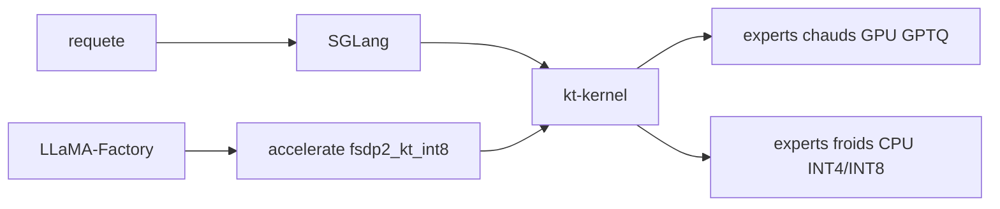

# kvcache-ai/ktransformers

> Noyaux CPU-GPU hétérogènes pour servir et affiner de très gros modèles MoE sur peu de VRAM.

## Le problème
Un modèle MoE comme DeepSeek-V3 ne tient pas sur les GPU que tu as sous la main.
Décharger sur CPU avec les outils génériques fait s'effondrer le débit et sature la mémoire hôte.

## Ce que ça fait vraiment
Fournit des noyaux CPU optimisés AMX et AVX512/AVX2 pour l'inférence quantifiée INT4/INT8.
Gère le placement des experts MoE de façon consciente du NUMA : experts chauds sur GPU, froids sur CPU.
S'intègre à SGLang pour le service, et à LlamaFactory pour le fine-tuning LoRA ou complet.
Mesures annoncées : DeepSeek-V3 affiné à 3,7 it/s sur 4×RTX 4090, ~80 Go de mémoire GPU au total.

## Comment c'est branché


## Essayer
```bash
cd kt-kernel
pip install .
```
Pour le fine-tuning : `python -m pip install "ktransformers[sft]==0.7.0"`, `python -m pip install "sglang-kt==0.7.0"`,
puis `accelerate launch --config_file examples/ktransformers/accelerate/fsdp2_kt_int8.yaml src/train.py ...`.

## Coût et pièges
Plusieurs GPU et un CPU Xeon récent (AMX) pour retrouver les chiffres annoncés ; l'exemple d'installation
cible une machine CUDA 13.0 avec `bash scripts/setup_verl.sh`. Les gains dépendent du matériel exact.

## Ce que ce n'est pas
Pas un serveur d'inférence complet : c'est une couche de noyaux que SGLang ou LlamaFactory appellent.
Pas un produit stabilisé : le README se présente comme un projet de recherche.
Pas le dépôt d'origine tel quel : le cadre KTransformers intégré a été déplacé dans `archive/`.

## Alternatives
`ZeRO-Offload` — le point de comparaison cité, 6 à 12× plus lent sur leurs charges MoE.
`llama.cpp` / GGUF — si tu veux du CPU pur sans cette chaîne de compilation.

## Pour toi
À garder en tête le jour où tu voudras affiner un MoE géant sans budget H100 ; pas pour aujourd'hui.
