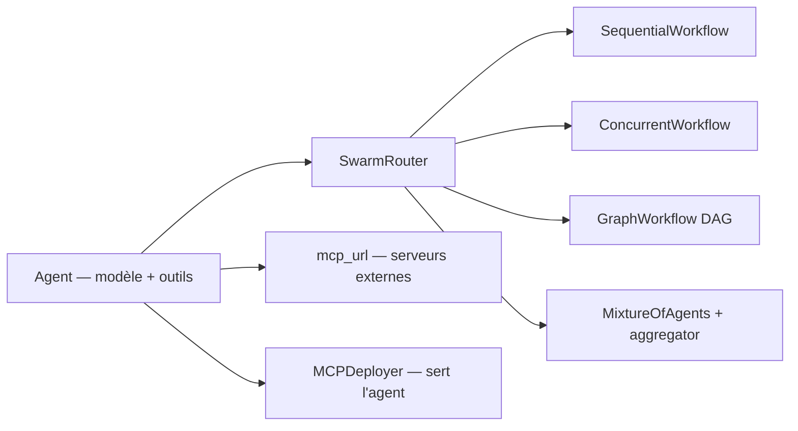

# kyegomez/swarms

> Framework Python d'orchestration multi-agents avec une soixantaine d'architectures préconstruites.

## Le problème
Passer d'un agent seul à plusieurs agents coordonnés oblige à réécrire à chaque fois la même
plomberie : passage de contexte, exécution parallèle, agrégation, dépendances entre étapes.

## Ce que ça fait vraiment
Un objet `Agent` (modèle + outils + mémoire), et des structures pour les assembler.
`SequentialWorkflow` enchaîne, `ConcurrentWorkflow` parallélise, `AgentRearrange` décrit les
relations par une chaîne de caractères façon `einsum`, `GraphWorkflow` exécute un DAG avec tri
topologique et parallélisme automatique des branches indépendantes, `MixtureOfAgents` fait
converger des experts vers un agrégateur, `GroupChat` laisse chaque agent décider s'il prend la
parole, `HierarchicalSwarm` place un directeur au-dessus d'ouvriers. `SwarmRouter` donne une
interface unique : changer `swarm_type` suffit. Côté MCP, un agent consomme des serveurs via
`mcp_url`, et `MCPDeployer` transforme un agent ou un swarm en serveur MCP authentifié.

## Comment c'est branché


## Essayer
```bash
pip3 install -U swarms
uv pip install swarms
poetry add swarms
git clone https://github.com/kyegomez/swarms.git
pip install -r requirements.txt
```

## Coût et pièges
Le framework est gratuit, les modèles non : chaque agent consomme des tokens, et `max_loops="auto"`
laisse l'agent décider lui-même quand s'arrêter — le README recommande explicitement une valeur
fixe pour les pipelines sensibles au coût ou à la latence. Un serveur `MCPDeployer` sans
authentification refuse de démarrer sauf `allow_anonymous=True`. `GroupChat` impose de donner
`RESPOND_TOOL` à chaque agent.

## Ce que ce n'est pas
Le README est très promotionnel : « le plus fiable », « enterprise-grade », sans mesure à l'appui.
Le dépôt appartient à une personne, ce qui pèse pour un composant d'infrastructure. Le README est
tronqué avant la fin. La section Docker est commentée, donc non supportée.

## Alternatives
Aucune alternative nommée dans le README ; il revendique seulement la compatibilité ascendante
avec d'autres frameworks d'agents.

## Pour toi
Bon catalogue de patterns à lire ; méfie-toi d'en dépendre en production vu la gouvernance.
