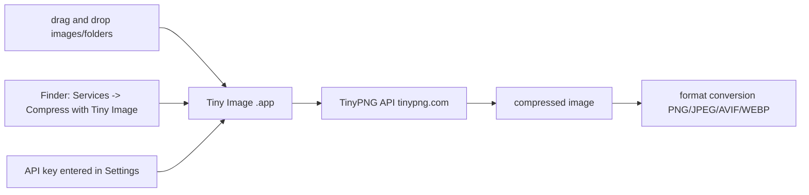

# kyleduo/TinyPNG4Mac

> **A third-party macOS client for TinyPNG**, to compress images without opening a browser.

## The problem

Using TinyPNG normally means opening the website, dropping files in one at a time and pulling
the results back by hand. On a batch of images or a whole folder, that browser round-trip is
the bottleneck.

## What it actually does

The app — renamed "Tiny Image" — is a desktop client for the TinyPNG service. You paste your
API key into the `Settings` window, then drag images or directories containing images onto the
window. There is also a Finder entry point: right-click image files or folders and choose
`Services -> Compress with Tiny Image`. Since 2.2.1 it can convert formats too, either to a
chosen format or by automatically picking the smallest among PNG, JPEG, AVIF and WEBP, and it
caches the count of compressed images. The compression itself is not local: it is handed off to
the TinyPNG service.

## How it is wired



No code-derived diagram exists for this repository; this one is reconstructed from the README,
which names no source files.

## Trying it

```
No installation command is documented in the README.
```

The README points to the [Release Page](https://github.com/kyleduo/TinyPNG4Mac/releases) for
the download, then: register an API key at tinypng.com/developers, paste it into `Settings`,
drag images onto the window. If the app will not open, the README says to check
`System Settings -> Security & privacy`.

## Cost and gotchas

The code is MIT-licensed, but actual use requires a TinyPNG API key you register yourself: the
quota and any bill are on you, and the README documents neither pricing nor limits. One explicit
system constraint: versions 2.0.0+ require macOS 13 Ventura or later, and older systems must
stay on a previous release. Images leave your machine to be processed by a third-party service —
something to weigh for confidential visuals.

## What it is not

It is not a local compressor: without an API key and a connection to the TinyPNG service, the
app does nothing. It is not a command-line tool or an embeddable library either — it is a macOS
app, and the README mentions no scriptable interface and no other platform. It is not an official
TinyPNG product: the README presents it as a third-party client.

## Alternatives

The only other repository named in the README is
[droptogif](https://github.com/mortenjust/droptogif), cited as the inspiration for window
creation rather than as an equivalent: it converts video to GIF. No neighbours were supplied, so
there is no comparable alternative in the catalogue.

## Why it matters to you

Marginal interest for a data / AI / MLOps profile: this is a macOS desktop utility, not a
pipeline component. Handy now and then to shrink report or documentation visuals, provided you
accept sending images to a hosted service. For compressing images inside an automated chain,
look elsewhere.
