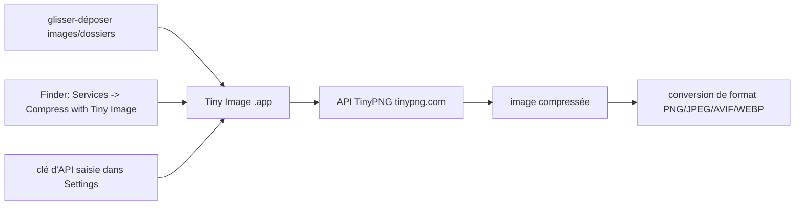

# kyleduo/TinyPNG4Mac

> **Client macOS tiers de TinyPNG**, pour compresser des images sans passer par le navigateur.

## Le problème

Compresser des images via TinyPNG suppose d'ouvrir le site, de déposer les fichiers un à un et
de récupérer les résultats à la main. Sur un lot d'images ou un dossier entier, la boucle
navigateur devient le goulot d'étranglement.

## Ce que ça fait vraiment

L'app, renommée « Tiny Image », est un client de bureau pour le service TinyPNG. On colle sa
clé d'API dans la fenêtre `Settings`, puis on glisse des images ou des dossiers contenant des
images sur la fenêtre. Un point d'entrée Finder existe aussi : clic droit sur des fichiers ou
des dossiers, puis `Services -> Compress with Tiny Image`. Depuis la 2.2.1, elle sait aussi
convertir de format — vers un format choisi, ou en retenant automatiquement le plus petit
parmi PNG, JPEG, AVIF et WEBP — et met en cache le nombre d'images compressées. La compression
elle-même n'est pas faite localement : elle est déléguée au service TinyPNG.

## Comment c'est branché



Aucun diagramme tiré du code n'existe pour ce dépôt : ce schéma est reconstruit depuis le
README, qui ne nomme aucun fichier source.

## Essayer

```
Aucune commande d'installation n'est documentée dans le README.
```

Le README renvoie à la [Release Page](https://github.com/kyleduo/TinyPNG4Mac/releases) pour
télécharger l'app, puis : enregistrer une clé d'API sur tinypng.com/developers, la coller dans
`Settings`, glisser des images sur la fenêtre. Si l'app refuse de s'ouvrir, le README indique
d'aller voir `System Settings -> Security & privacy`.

## Coût et pièges

Le code est sous licence MIT, mais l'usage réel passe par une clé d'API TinyPNG à créer soi-même :
le quota et la facture éventuelle sont chez toi, et le README ne documente ni tarif ni limite.
Contrainte système explicite : les versions 2.0.0+ exigent macOS 13 Ventura ou plus récent, les
systèmes antérieurs doivent rester sur une version précédente. Les images sortent de ta machine
pour être traitées par un service tiers — à peser pour des visuels confidentiels.

## Ce que ce n'est pas

Ce n'est pas un compresseur local : sans clé d'API et sans connexion au service TinyPNG, l'app
ne fait rien. Ce n'est pas non plus un outil en ligne de commande ni une bibliothèque
intégrable — c'est une app macOS, et le README ne mentionne aucune interface scriptable ni
aucune autre plateforme. Ce n'est pas un produit officiel de TinyPNG : le README le présente
comme un client tiers.

## Alternatives

Le seul autre dépôt nommé dans le README est [droptogif](https://github.com/mortenjust/droptogif),
cité comme source d'inspiration pour la création de fenêtre et non comme équivalent : il
convertit des vidéos en GIF. Aucun voisin n'a été fourni, donc aucune alternative comparable
dans le catalogue.

## Pour toi

Intérêt marginal pour un profil data / IA / MLOps : c'est un utilitaire de poste de travail
macOS, pas une brique de pipeline. Utile ponctuellement pour alléger des visuels de rapport ou
de documentation, à condition d'accepter d'envoyer les images à un service hébergé. Pour
compresser des images dans une chaîne automatisée, passer son chemin.
