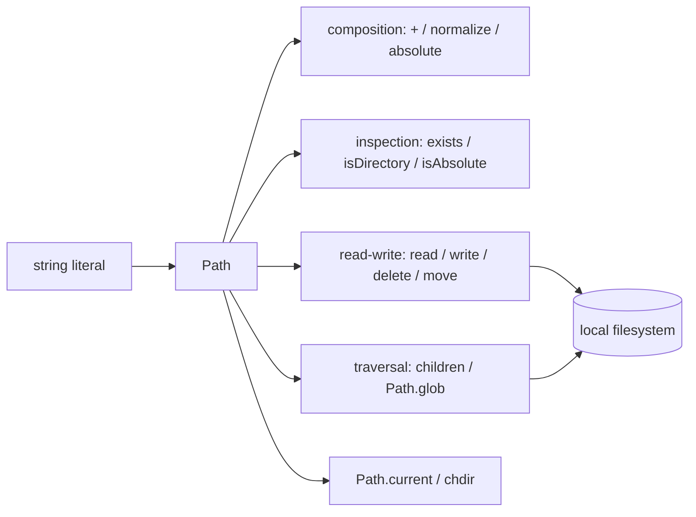

# kylef/PathKit

> **One sentence.** A `Path` type for Swift that wraps everyday filesystem operations behind a single value.

## The problem

Without a path abstraction, Swift filesystem work is done on raw strings and scattered low-level
calls: joining two paths, testing whether one is absolute, normalising it or reading its contents
each require a detour. The README does not state this problem explicitly; it only advertises
"path operations in Swift".

## What it actually does

The README documents a single type, `Path`, built from a string literal
(`Path("/usr/bin/swift")`), with the usual operations attached to it:

- composition: `Path("/usr/bin") + Path("swift")` through the `+` operator;
- inspection: `isAbsolute`, `isRelative`, `exists()`, `isDirectory()`;
- transformation: `absolute()` and `normalize()`, the latter cleaning up redundant `..`, `.` and
  double slashes;
- filesystem mutation: `delete()`, `move(newPath)`, `write("Hello World!")`, `read()`;
- traversal: `children()` for directory entries, `Path.glob("*.swift")` for a pattern;
- working directory: reading and assigning `Path.current`, plus `path.chdir { ... }`, which sets
  `Path.current` to `path` for the duration of the closure.

Nothing else appears in the README: no async API, no error handling, no URL bridging.

## How it is wired

No code-derived diagram exists for this repository; the graph below is reconstructed from the
pieces named in the README only.



## Trying it

The README documents **no** install or build command: no CocoaPods, Carthage or Swift Package
Manager line, no `swift build`, no test command. It only shows Swift usage snippets, to be copied
into a project once the dependency has been added by some undocumented means.

```swift
let path = Path("/usr/bin/swift")
let normalizedPath = path.normalize()
let paths = Path.glob("*.swift")
```

## Cost and gotchas

Free, no API key, no third-party service, no account: it is a Swift library compiled into your
own project. The real cost sits elsewhere — the README carries a Travis CI badge
(`travis-ci.org`), a continuous-integration setup from an earlier era, and states no version, no
platform support matrix and no minimum Swift version. You have to check yourself that it builds
against your toolchain before committing to it.

## What it is not

It is not a networking layer or remote filesystem client: everything revolves around the local
filesystem. It is not a full replacement for `FileManager` or `URL` either — the README covers
neither permissions, attributes, copying, directory creation, nor explicit error handling.
Finally, `chdir` and `Path.current` touch process-wide global state: convenient in a script,
to be handled carefully anywhere else.

## Alternatives

The README names no other project, and no neighbours were supplied for this repository: no
comparable alternative in the catalogue. The natural comparison remains Apple's own standard
library (`FileManager`, `URL`), which is not a catalogue repository.

## Why it matters to you

Marginal interest for a data / AI / MLOps profile, whose daily tooling is Python: PathKit is only
useful if you write Swift, typically a command-line tool or a macOS/iOS app. In that case it
removes path plumbing; otherwise, move on.
