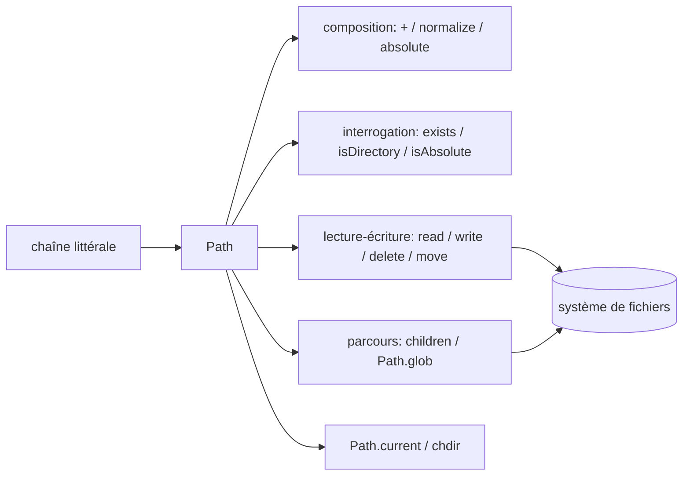

# kylef/PathKit

> **Une phrase.** Un type `Path` en Swift pour manipuler chemins et fichiers sans passer par les API de bas niveau.

## Le problème

Sans une abstraction de chemin, chaque opération de fichier en Swift se fait à coups de chaînes
de caractères et d'appels dispersés : joindre deux chemins, savoir s'il est absolu, le normaliser
ou lire son contenu demandent à chaque fois un détour. Le README ne formule pas ce problème
explicitement — il se contente d'annoncer des « path operations » en Swift.

## Ce que ça fait vraiment

Le README expose un seul type, `Path`, construit depuis une chaîne (`Path("/usr/bin/swift")`),
et lui accroche les opérations courantes :

- composition : `Path("/usr/bin") + Path("swift")` via l'opérateur `+` ;
- interrogation : `isAbsolute`, `isRelative`, `exists()`, `isDirectory()` ;
- transformation : `absolute()` et `normalize()`, ce dernier nettoyant les `..`, `.` et doubles
  barres obliques redondants ;
- mutation du système de fichiers : `delete()`, `move(newPath)`, `write("Hello World!")`,
  `read()` ;
- parcours : `children()` pour les entrées d'un répertoire, `Path.glob("*.swift")` pour un motif ;
- répertoire courant : lecture et écriture de `Path.current`, plus `path.chdir { ... }` qui fixe
  `Path.current` à `path` pendant l'exécution de la closure.

Rien d'autre n'est documenté dans le README : ni asynchrone, ni gestion d'erreurs, ni URL.

## Comment c'est branché

Aucun diagramme tiré du code n'existe pour ce dépôt ; le schéma ci-dessous est reconstruit
depuis les seules pièces nommées dans le README.



## Essayer

Le README ne documente **aucune** commande d'installation ni de build : pas de ligne CocoaPods,
Carthage ou Swift Package Manager, pas de `swift build`, pas de commande de test. Il ne montre
que du code d'usage Swift, à recopier dans un projet une fois la dépendance ajoutée par un moyen
non décrit.

```swift
let path = Path("/usr/bin/swift")
let normalizedPath = path.normalize()
let paths = Path.glob("*.swift")
```

## Coût et pièges

Gratuit, sans clé d'API, sans service tiers, sans compte : c'est une bibliothèque Swift que l'on
compile avec son projet. Le coût réel est ailleurs — le README affiche un badge Travis CI
(`travis-ci.org`), signe d'une intégration continue d'une génération passée, et n'annonce ni
version, ni compatibilité de plateforme, ni version de Swift minimale. Il faut donc vérifier
soi-même que la bibliothèque compile avec la toolchain visée avant de s'engager.

## Ce que ce n'est pas

Ce n'est pas une couche réseau ni un accès à des systèmes de fichiers distants : tout tourne
autour du système de fichiers local. Ce n'est pas non plus un remplacement complet de
`FileManager` ou de `URL` — le README ne couvre ni permissions, ni attributs, ni copie, ni
création de répertoires, ni gestion explicite des erreurs. Enfin, `chdir` et `Path.current`
touchent un état global du processus : pratique en script, à manier avec prudence ailleurs.

## Alternatives

Le README ne nomme aucun autre projet, et aucun voisin n'a été fourni pour ce dépôt : aucune
alternative comparable dans le catalogue. La comparaison naturelle reste la bibliothèque standard
Apple (`FileManager`, `URL`), qui n'est pas un dépôt du catalogue.

## Pour toi

Intérêt marginal pour un profil data / IA / MLOps, dont l'outillage quotidien est en Python :
PathKit ne sert que si l'on écrit du Swift, typiquement un outil en ligne de commande ou une app
macOS/iOS. Dans ce cas seulement, il évite la plomberie de chemins ; sinon, passer son chemin.
