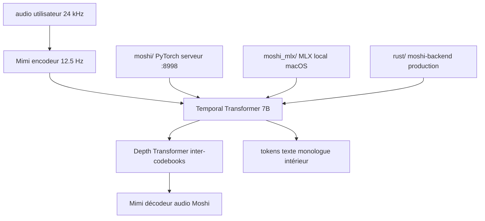

# kyutai-labs/moshi

> Modèle parole-texte full-duplex pour dialogue temps réel, avec le codec audio en flux Mimi.

## Le problème
Un assistant vocal assemblé en ASR puis LLM puis TTS parle chacun à son tour et accumule la latence.
Les codecs neuronaux existants ne sont pas en flux, ce qui interdit le temps réel.

## Ce que ça fait vraiment
Modélise deux flux audio — celui de Moshi et celui de l'utilisateur — et prédit en parallèle les tokens texte de sa propre parole, son « monologue intérieur ».
Un petit Depth Transformer traite les dépendances entre codebooks, un Temporal Transformer de 7 milliards de paramètres le temps ; latence théorique 160 ms, environ 200 ms en pratique sur un GPU L4.
Mimi encode du 24 kHz vers 12,5 Hz à 1,1 kbps en flux (80 ms de latence), avec Transformer dans l'encodeur et le décodeur, perte de distillation vers WavLM et entraînement adversarial uniquement.
Trois piles d'inférence dans le dépôt : PyTorch (`moshi/`) pour la recherche, MLX (`moshi_mlx/`) pour iPhone et Mac, Rust (`rust/`) pour la production, plus un client web (`client/`).

## Comment c'est branché


## Essayer
```bash
pip install -U moshi
pip install -U moshi_mlx
pip install rustymimi
python -m moshi.server [--gradio-tunnel] [--hf-repo kyutai/moshika-pytorch-bf16]
python -m moshi.client [--url URL_TO_GRADIO]
python -m moshi_mlx.local -q 4
cargo run --features cuda --bin moshi-backend -r -- --config moshi-backend/config.json standalone
docker compose up
```

## Coût et pièges
Modèles sous CC-BY 4.0, gratuits. En PyTorch, pas de quantification : il faut un GPU d'environ 24 Go. Python 3.10 minimum, 3.12 recommandé — sinon il faut la chaîne Rust pour installer `rustymimi`.
Un serveur distant en HTTP bloque le micro dans le navigateur : il faut transférer le port 8998 en SSH ou passer par `--gradio-tunnel`, qui ajoute jusqu'à 500 ms depuis l'Europe. Windows n'est pas officiellement supporté.

## Ce que ce n'est pas
Pas un assistant prêt à l'emploi : les clients CLI sont minimaux, sans annulation d'écho ni compensation de retard — l'UI web est recommandée.
Pas un modèle à affiner ici : le fine-tuning vit dans `kyutai-labs/moshi-finetune`.
Pas un simple TTS ou ASR : ce sont d'autres modèles Kyutai, dans le dépôt Delayed Streams Modeling.

## Alternatives
- SpeechTokenizer, SemantiCodec, SoundStream, EnCodec : codecs cités comme points de comparaison ou fondations de Mimi.
- Hibiki : traduction vocale simultanée, même architecture multi-flux.

## Pour toi
À surveiller pour le duplex temps réel ; les 24 Go de GPU en PyTorch réservent l'essai à une machine dédiée.
