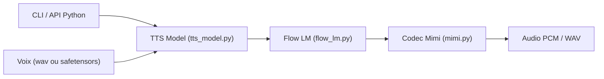

# kyutai-labs/pocket-tts

> Synthèse vocale légère de Kyutai qui tourne sur CPU, avec clonage de voix, pour développeurs voulant du TTS local.

## Le problème
Les modèles de synthèse vocale réclament d'ordinaire un GPU ou une API distante payante.

## Ce que ça fait vraiment
Modèle d'environ 100 millions de paramètres, premier morceau d'audio en ~200 ms, plus rapide que le temps réel sur un MacBook Air M4 avec deux cœurs. Fonctionne en ligne de commande (`generate`, `serve`, `export-voice`) et en bibliothèque Python. Six langues, clonage à partir d'un fichier wav, textes de longueur illimitée. Le code d'entraînement a été publié en août 2026.

## Comment c'est branché


## Essayer
```bash
uvx pocket-tts generate
uvx pocket-tts serve
pip install pocket-tts
pip install pocket-tts --extra-index-url https://download.pytorch.org/whl/cpu
```

## Coût et pièges
Gratuit. Sur Linux, `pip install` tire la version CUDA de PyTorch (environ 3 Go) sauf si l'on utilise l'index CPU. Les poids sont téléchargés depuis Hugging Face. Le clonage de voix sans consentement est explicitement interdit.

## Ce que ce n'est pas
Le GPU n'est pas officiellement pris en charge (pas d'option de périphérique dans `load_model`), et `serve` et l'image Docker restent sur CPU.

## Alternatives
Le README liste des ports : pocket-tts-mlx (Apple Silicon), PocketTTS.cpp, sherpa-onnx, pocket-tts-candle.

## Pour toi
À adopter : TTS local sur CPU, licence MIT, installation en une ligne ; idéal pour prototyper un assistant vocal sans GPU ni API.

