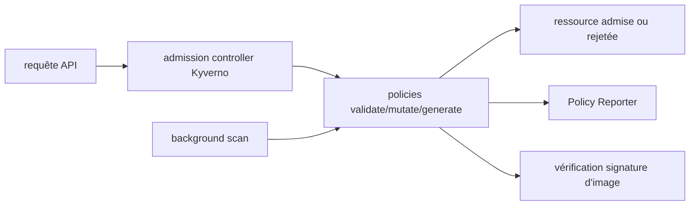

# kyverno/kyverno

> Moteur de politiques natif Kubernetes : valider, muter, générer et nettoyer des ressources.

## Le problème
Faire respecter des règles de sécurité et de conformité sur un cluster demande sinon d'écrire des webhooks d'admission maison, coûteux à maintenir.

## Ce que ça fait vraiment
Valide, mute, génère et nettoie des ressources, via les contrôles d'admission Kubernetes et des scans en tâche de fond.
Vérifie les signatures d'images conteneur pour la sécurité de la chaîne d'approvisionnement.
S'utilise avec les outils déjà en place : `kubectl`, `kustomize`, Git.
Complète les contrôles natifs (`ValidatingAdmissionPolicies`, `MutatingAdmissionPolicies`) par du reporting, la gestion d'exceptions et le scan périodique.

## Comment c'est branché

## Essayer
Aucune commande n'est documentée dans le README : il renvoie au Quick Start et au guide d'installation sur kyverno.io.

## Coût et pièges
Gratuit, projet CNCF. Un webhook d'admission est sur le chemin critique de l'API server : une politique mal écrite bloque les déploiements. Les politiques doivent être maintenues comme tout produit de sécurité.

## Ce que ce n'est pas
Le README est explicite sur ses non-objectifs : Kyverno ne protège pas contre les failles de conception de Kubernetes lui-même, ne remplace pas RBAC (qui gère l'accès, là où Kyverno gère la conformité), et n'applique que les règles que tu as écrites. Les tests bout en bout, le reporting et le JSON hors Kubernetes sont des projets séparés.

## Alternatives
Chainsaw (tests e2e), Policy Reporter (rapports et UI), Kyverno JSON, Kyverno Envoy Plugin — projets compagnons couvrant ce que le moteur ne fait pas.

## Pour toi
La façon standard d'imposer des garde-fous sur un cluster partagé : quotas GPU, images autorisées, labels d'imputation.
