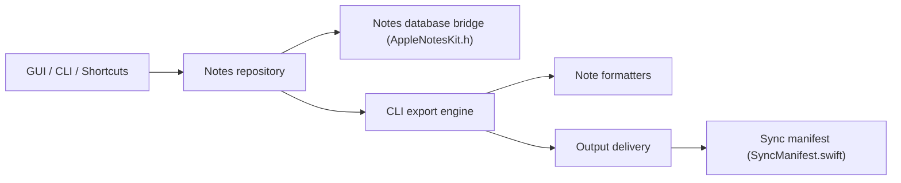

# kzaremski/apple-notes-exporter

> App macOS qui exporte en masse Apple Notes vers de nombreux formats, avec CLI, Shortcuts et MCP.

## Le problème
Apple Notes n'offre aucun moyen d'exporter toute la bibliothèque en conservant dossiers, mise en forme et pièces jointes.

## Ce que ça fait vraiment
Lit directement la base Notes (comptes iCloud et « Sur mon Mac ») et exporte en dossier, ZIP, TAR ou fichier unique, dans 18 formats (HTML, PDF, Markdown, DOCX, EPUB, JSON, JSONL, ENEX, etc.). Synchronisation incrémentale par manifeste. Pilotable par GUI, CLI `notes-export`, cinq actions Shortcuts et serveur MCP à six outils.

## Comment c'est branché


## Essayer
```bash
notes-export list-accounts
notes-export export --output ~/Desktop/notes --format markdown --account iCloud
notes-export export --output ~/backups/notes --format markdown --incremental
```

## Coût et pièges
Gratuit. macOS Big Sur 11+, accès complet au disque obligatoire. Les notes de comptes e-mail (Gmail, Yahoo) ne sont pas exportables sans les déplacer vers iCloud. L'export MCP n'écrit que sous $HOME ou /tmp.

## Ce que ce n'est pas
Pas un outil multiplateforme ni un synchroniseur bidirectionnel : il exporte seulement. Le contenu des notes est à traiter comme une entrée non fiable pour un assistant.

## Alternatives
Aucune alternative nommée dans le README.

## Pour toi
À surveiller : pratique pour alimenter un pipeline RAG depuis tes notes (JSONL), seulement si tu es sur Mac ; GPL-3.0, un seul mainteneur.

