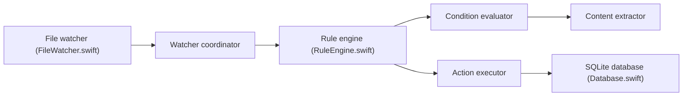

# lab421/forel

> Application macOS en barre de menus qui range automatiquement les fichiers selon des règles, alternative à Hazel.

## Le problème
Les dossiers comme Téléchargements se remplissent et le classement manuel est répétitif.

## Ce que ce n'est pas qu'un rangement… (voir plus bas)

## Ce que ça fait vraiment
Surveille des dossiers (FSEvents) et applique des règles : nom, extension, taille, date, étiquettes, contenu (OCR local via Vision). Actions : déplacer, copier, renommer, étiqueter, corbeille, supprimer, lancer un script. Aperçu à blanc, historique avec annulation, base SQLite locale.

## Comment c'est branché


## Essayer
```bash
brew install --cask lab421/tap/forel
git clone https://github.com/lab421/forel.git
cd forel
swift build
swift test
swift run
```

## Coût et pièges
Gratuit, traitement sur la machine, sans clé d'API. Les actions « supprimer » et scripts sont réels : utiliser l'aperçu à blanc d'abord. Incohérence : le README cite macOS 13 et 14.

## Ce que ce n'est pas
Pas un outil cloud ni IA : aucun envoi de fichiers. Pas disponible hors macOS.

## Alternatives
Hazel (payant), cité comme l'application dont il est l'alternative.

## Pour toi
À ignorer : utilitaire macOS d'organisation de fichiers, sans rapport avec data, IA ou MLOps.

